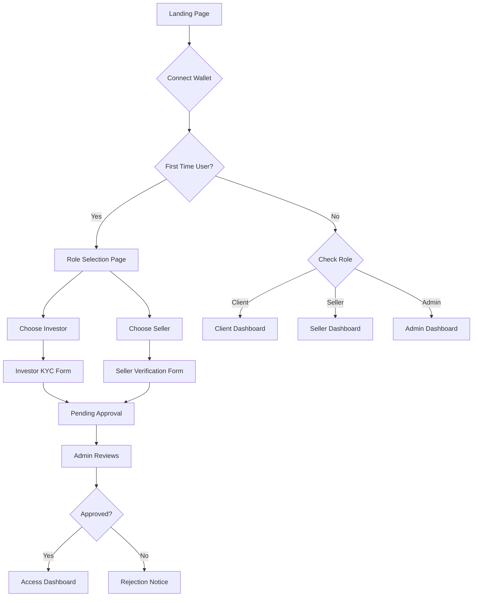

# 🏗️ FRACTIONAL REAL ESTATE PLATFORM - COMPLETE FRONTEND ARCHITECTURE

## 📋 TABLE OF CONTENTS
1. [System Overview](#system-overview)
2. [Role-Based Architecture](#role-based-architecture)
3. [Design System](#design-system)
4. [Page Specifications](#page-specifications)
5. [Component Library](#component-library)
6. [State Machines](#state-machines)
7. [API Contracts](#api-contracts)
8. [File Structure](#file-structure)
9. [Mock Data](#mock-data)
10. [Acceptance Tests](#acceptance-tests)

---

## 1. SYSTEM OVERVIEW

### Platform Purpose
A blockchain-based fractional real estate investment platform enabling:
- **Clients/Investors**: Buy property shares, earn rental income, trade on secondary market
- **Sellers/Property Owners**: List properties, manage documentation, receive funding
- **Admins**: Platform management, KYC approval, property verification, rent distribution

### Tech Stack
- **Framework**: Next.js 14 (App Router)
- **Styling**: Tailwind CSS
- **Blockchain**: Wagmi v2 + Viem + RainbowKit
- **State**: React Context + Hooks
- **Network**: Arbitrum Sepolia (testnet)

### Core Features Matrix

| Feature | Client | Seller | Admin |
|---------|--------|--------|-------|
| Wallet Connect | ✅ | ✅ | ✅ |
| KYC Submission | ✅ | ✅ | ❌ |
| Browse Properties | ✅ | ✅ | ✅ |
| Buy Shares | ✅ | ❌ | ❌ |
| Claim Rewards | ✅ | ❌ | ❌ |
| List Properties | ❌ | ✅ | ✅ |
| Manage Documents | ❌ | ✅ | ✅ |
| KYC Approval | ❌ | ❌ | ✅ |
| Deposit Rent | ❌ | ❌ | ✅ |
| Platform Analytics | ❌ | ❌ | ✅ |

---

## 2. ROLE-BASED ARCHITECTURE

### 2.1 User Registration Flow



### 2.2 Smart Contract Role Management

```solidity
// Add to existing contracts
contract UserRegistry {
    enum Role { NONE, CLIENT, SELLER, ADMIN }
    enum KYCStatus { NONE, PENDING, APPROVED, REJECTED }
    
    struct User {
        Role role;
        KYCStatus kycStatus;
        uint256 registeredAt;
        string email;
        string kycDocumentHash; // IPFS hash
    }
    
    mapping(address => User) public users;
    mapping(address => bool) public isAdmin;
    
    event UserRegistered(address indexed user, Role role);
    event KYCSubmitted(address indexed user, string documentHash);
    event KYCApproved(address indexed user);
    event KYCRejected(address indexed user, string reason);
    
    modifier onlyAdmin() {
        require(isAdmin[msg.sender], "Not admin");
        _;
    }
    
    modifier onlyApprovedKYC() {
        require(users[msg.sender].kycStatus == KYCStatus.APPROVED, "KYC not approved");
        _;
    }
    
    function registerAsClient(string memory email) external {
        require(users[msg.sender].role == Role.NONE, "Already registered");
        users[msg.sender] = User({
            role: Role.CLIENT,
            kycStatus: KYCStatus.NONE,
            registeredAt: block.timestamp,
            email: email,
            kycDocumentHash: ""
        });
        emit UserRegistered(msg.sender, Role.CLIENT);
    }
    
    function registerAsSeller(string memory email) external {
        require(users[msg.sender].role == Role.NONE, "Already registered");
        users[msg.sender] = User({
            role: Role.SELLER,
            kycStatus: KYCStatus.NONE,
            registeredAt: block.timestamp,
            email: email,
            kycDocumentHash: ""
        });
        emit UserRegistered(msg.sender, Role.SELLER);
    }
    
    function submitKYC(string memory documentHash) external {
        require(users[msg.sender].role != Role.NONE, "Not registered");
        require(users[msg.sender].kycStatus != KYCStatus.APPROVED, "Already approved");
        
        users[msg.sender].kycStatus = KYCStatus.PENDING;
        users[msg.sender].kycDocumentHash = documentHash;
        emit KYCSubmitted(msg.sender, documentHash);
    }
    
    function approveKYC(address user) external onlyAdmin {
        require(users[user].kycStatus == KYCStatus.PENDING, "No pending KYC");
        users[user].kycStatus = KYCStatus.APPROVED;
        emit KYCApproved(user);
    }
    
    function rejectKYC(address user, string memory reason) external onlyAdmin {
        require(users[user].kycStatus == KYCStatus.PENDING, "No pending KYC");
        users[user].kycStatus = KYCStatus.REJECTED;
        emit KYCRejected(user, reason);
    }
    
    function getUserRole(address user) external view returns (Role) {
        return users[user].role;
    }
    
    function isKYCApproved(address user) external view returns (bool) {
        return users[user].kycStatus == KYCStatus.APPROVED;
    }
}
```

### 2.3 Frontend Role Detection Hook

```typescript
// hooks/useUserRole.ts
import { useAccount, useReadContract } from 'wagmi'
import { USER_REGISTRY_ABI, USER_REGISTRY_ADDRESS } from '@/lib/contracts'

export type UserRole = 'NONE' | 'CLIENT' | 'SELLER' | 'ADMIN'
export type KYCStatus = 'NONE' | 'PENDING' | 'APPROVED' | 'REJECTED'

export function useUserRole() {
  const { address, isConnected } = useAccount()
  
  const { data: roleData } = useReadContract({
    address: USER_REGISTRY_ADDRESS,
    abi: USER_REGISTRY_ABI,
    functionName: 'users',
    args: [address],
    query: { enabled: !!address }
  })
  
  const role: UserRole = roleData ? 
    ['NONE', 'CLIENT', 'SELLER', 'ADMIN'][Number(roleData[0])] as UserRole : 
    'NONE'
    
  const kycStatus: KYCStatus = roleData ?
    ['NONE', 'PENDING', 'APPROVED', 'REJECTED'][Number(roleData[1])] as KYCStatus :
    'NONE'
  
  const isRegistered = role !== 'NONE'
  const isKYCApproved = kycStatus === 'APPROVED'
  const canTrade = isKYCApproved && (role === 'CLIENT' || role === 'ADMIN')
  const canListProperty = isKYCApproved && (role === 'SELLER' || role === 'ADMIN')
  
  return {
    address,
    isConnected,
    role,
    kycStatus,
    isRegistered,
    isKYCApproved,
    canTrade,
    canListProperty,
    isClient: role === 'CLIENT',
    isSeller: role === 'SELLER',
    isAdmin: role === 'ADMIN',
  }
}
```

---

## 3. DESIGN SYSTEM

### 3.1 Color Palette (Airbnb-Inspired)

```typescript
// tailwind.config.js theme extension
colors: {
  // Primary - Warm Red (Airbnb style)
  primary: {
    50: '#FFF5F5',
    100: '#FFE3E3',
    200: '#FFC9C9',
    300: '#FFA8A8',
    400: '#FF8787',
    500: '#FF6B6B',  // Main brand color
    600: '#FA5252',
    700: '#F03E3E',
    800: '#E03131',
    900: '#C92A2A',
  },
  
  // Secondary - Teal (Trust, Finance)
  secondary: {
    50: '#E6FCFF',
    100: '#C3FAFE',
    200: '#A5F3FC',
    300: '#67E8F9',
    400: '#22D3EE',
    500: '#06B6D4',  // Main accent
    600: '#0891B2',
    700: '#0E7490',
    800: '#155E75',
    900: '#164E63',
  },
  
  // Neutral (Clean backgrounds)
  gray: {
    50: '#F9FAFB',
    100: '#F3F4F6',
    200: '#E5E7EB',
    300: '#D1D5DB',
    400: '#9CA3AF',
    500: '#6B7280',
    600: '#4B5563',
    700: '#374151',
    800: '#1F2937',
    900: '#111827',
  },
  
  // Status colors
  success: '#10B981',
  warning: '#F59E0B',
  error: '#EF4444',
  info: '#3B82F6',
  
  // Background
  background: '#FAFAFA',
  surface: '#FFFFFF',
}
```

### 3.2 Typography Scale

```css
/* globals.css */
@layer base {
  /* Headings */
  .heading-xl { @apply text-5xl font-bold tracking-tight; }      /* 48px */
  .heading-lg { @apply text-4xl font-bold tracking-tight; }      /* 36px */
  .heading-md { @apply text-3xl font-bold tracking-tight; }      /* 30px */
  .heading-sm { @apply text-2xl font-semibold tracking-tight; }  /* 24px */
  .heading-xs { @apply text-xl font-semibold; }                  /* 20px */
  
  /* Body text */
  .text-body-lg { @apply text-lg leading-relaxed; }              /* 18px */
  .text-body { @apply text-base leading-normal; }                /* 16px */
  .text-body-sm { @apply text-sm leading-normal; }               /* 14px */
  .text-caption { @apply text-xs leading-tight; }                /* 12px */
  
  /* Special */
  .text-display { @apply text-6xl font-black tracking-tighter; } /* Hero */
}
```

### 3.3 Component Patterns

```typescript
// Common component styles
export const styles = {
  // Cards
  card: 'bg-white rounded-xl shadow-sm border border-gray-100 p-6 hover:shadow-md transition-shadow',
  cardInteractive: 'bg-white rounded-xl shadow-sm border border-gray-100 p-6 hover:shadow-lg hover:border-primary-200 transition-all cursor-pointer',
  
  // Buttons
  btnPrimary: 'bg-primary-500 text-white px-6 py-3 rounded-full font-semibold hover:bg-primary-600 transition-colors shadow-sm hover:shadow-md',
  btnSecondary: 'bg-white text-gray-700 px-6 py-3 rounded-full font-semibold border-2 border-gray-300 hover:border-primary-500 hover:text-primary-500 transition-all',
  btnGhost: 'text-gray-700 px-4 py-2 rounded-full font-medium hover:bg-gray-100 transition-colors',
  
  // Inputs
  input: 'w-full px-4 py-3 rounded-lg border border-gray-300 focus:border-primary-500 focus:ring-2 focus:ring-primary-100 transition-all',
  inputError: 'border-error focus:border-error focus:ring-error/20',
  
  // Badges
  badge: 'inline-flex items-center px-3 py-1 rounded-full text-sm font-medium',
  badgeSuccess: 'bg-green-100 text-green-800',
  badgeWarning: 'bg-yellow-100 text-yellow-800',
  badgeError: 'bg-red-100 text-red-800',
  badgeInfo: 'bg-blue-100 text-blue-800',
  
  // Containers
  container: 'max-w-7xl mx-auto px-4 sm:px-6 lg:px-8',
  section: 'py-12 sm:py-16 lg:py-20',
}
```

### 3.4 Responsive Breakpoints

```javascript
// tailwind.config.js
screens: {
  'xs': '475px',
  'sm': '640px',
  'md': '768px',
  'lg': '1024px',
  'xl': '1280px',
  '2xl': '1536px',
}
```

---

## 4. PAGE SPECIFICATIONS

### 4.1 PUBLIC PAGES

#### A. Landing Page (`/`)

**Purpose**: Marketing page to attract investors and property owners

**Layout**:
```
┌─────────────────────────────────────────────────────────┐
│ HEADER: Logo | About | How It Works | [Connect Wallet] │
├─────────────────────────────────────────────────────────┤
│                                                         │
│              HERO SECTION                               │
│   "Invest in Real Estate,                              │
│    One Share at a Time"                                │
│                                                         │
│   [Start Investing] [List Your Property]               │
│                                                         │
├─────────────────────────────────────────────────────────┤
│                                                         │
│   FEATURED PROPERTIES (Carousel)                       │
│   [Property Card] [Property Card] [Property Card]      │
│                                                         │
├─────────────────────────────────────────────────────────┤
│                                                         │
│   HOW IT WORKS                                         │
│   1. Connect Wallet  2. Browse  3. Invest  4. Earn    │
│                                                         │
├─────────────────────────────────────────────────────────┤
│                                                         │
│   STATISTICS                                           │
│   $2.5M Total Value | 150+ Investors | 25 Properties  │
│                                                         │
├─────────────────────────────────────────────────────────┤
│                                                         │
│   WHY CHOOSE US                                        │
│   • Blockchain transparency                            │
│   • Low minimum investment                             │
│   • Monthly rental income                              │
│                                                         │
├─────────────────────────────────────────────────────────┤
│ FOOTER: Links | Social | Legal                        │
└─────────────────────────────────────────────────────────┘
```

**Components Used**:
- `<Hero />` - Main call-to-action section
- `<PropertyCarousel />` - Featured properties slider
- `<StatsGrid />` - Platform statistics
- `<FeatureGrid />` - Benefits showcase
- `<CTASection />` - Secondary conversion point

**States**:
- Loading: Show skeleton cards
- Connected: Show personalized content
- Not Connected: Show generic marketing

#### B. Role Selection Page (`/register`)

**Purpose**: First-time users choose their account type

**Layout**:
```
┌─────────────────────────────────────────────────────────┐
│                 [Back to Home]                          │
│                                                         │
│         Welcome to FractionalStay!                     │
│         Choose your account type                        │
│                                                         │
│  ┌──────────────────┐    ┌──────────────────┐        │
│  │       🏠         │    │       💼         │        │
│  │                  │    │                  │        │
│  │   INVESTOR       │    │  PROPERTY OWNER  │        │
│  │                  │    │                  │        │
│  │ • Buy shares     │    │ • List property  │        │
│  │ • Earn rent      │    │ • Get funded     │        │
│  │ • Trade shares   │    │ • Manage docs    │        │
│  │                  │    │                  │        │
│  │ [Continue as     │    │ [Continue as     │        │
│  │  Investor]       │    │  Seller]         │        │
│  └──────────────────┘    └──────────────────┘        │
│                                                         │
│         Already have an account?                       │
│         Your role will be detected automatically       │
│                                                         │
└─────────────────────────────────────────────────────────┘
```

**User Flow**:
1. User clicks "Start Investing" or "List Property" on landing
2. Wallet connection prompt appears
3. Check if user already registered (smart contract call)
4. If registered → redirect to appropriate dashboard
5. If new → show role selection
6. After selection → show KYC form

**Component**:
```typescript
// app/register/page.tsx
export default function RoleSelectionPage() {
  const { address, isConnected } = useAccount()
  const { role, isRegistered } = useUserRole()
  const router = useRouter()
  
  useEffect(() => {
    if (!isConnected) {
      router.push('/')
    }
    if (isRegistered) {
      // Redirect to dashboard based on role
      const dashboards = {
        CLIENT: '/dashboard',
        SELLER: '/seller/dashboard',
        ADMIN: '/admin/dashboard'
      }
      router.push(dashboards[role])
    }
  }, [isConnected, isRegistered, role])
  
  return (
    <div className="min-h-screen flex items-center justify-center bg-gray-50">
      <div className="max-w-5xl w-full px-4">
        <div className="text-center mb-12">
          <h1 className="heading-lg mb-4">Welcome to FractionalStay!</h1>
          <p className="text-body-lg text-gray-600">
            Choose your account type to get started
          </p>
        </div>
        
        <div className="grid md:grid-cols-2 gap-8">
          <RoleCard
            icon="🏠"
            title="Investor"
            description="Buy property shares and earn rental income"
            benefits={[
              'Low minimum investment (₹10,000)',
              'Monthly rental distributions',
              'Trade shares on marketplace',
              'Governance voting rights'
            ]}
            onSelect={() => router.push('/register/investor')}
          />
          
          <RoleCard
            icon="💼"
            title="Property Owner"
            description="List your property and get instant funding"
            benefits={[
              'Fractional property listing',
              'Instant liquidity',
              'Maintain ownership control',
              'Access to investor network'
            ]}
            onSelect={() => router.push('/register/seller')}
          />
        </div>
        
        <p className="text-center text-sm text-gray-500 mt-8">
          Already have an account? Your role will be detected when you connect your wallet.
        </p>
      </div>
    </div>
  )
}
```

#### C. Marketplace Page (`/marketplace` or `/properties`)

**Purpose**: Browse and discover investment opportunities

**Layout**:
```
┌─────────────────────────────────────────────────────────┐
│ HEADER: Logo | Marketplace | Dashboard | Wallet        │
├─────────────────────────────────────────────────────────┤
│                                                         │
│  Discover Properties                                   │
│  ┌──────────────────────────────────────┐             │
│  │ [Search] [Filters] [Sort]             │             │
│  └──────────────────────────────────────┘             │
│                                                         │
│  Filters: Location | Price | Type | Occupancy         │
│                                                         │
├─────────────────────────────────────────────────────────┤
│                                                         │
│  ┌───────────┐ ┌───────────┐ ┌───────────┐           │
│  │   IMG     │ │   IMG     │ │   IMG     │           │
│  │ Property 1│ │ Property 2│ │ Property 3│           │
│  │ ₹100/share│ │ ₹150/share│ │ ₹200/share│           │
│  │ 8.5% APY  │ │ 9.2% APY  │ │ 7.8% APY  │           │
│  │ [Details] │ │ [Details] │ │ [Details] │           │
│  └───────────┘ └───────────┘ └───────────┘           │
│                                                         │
│  [Load More Properties]                                │
│                                                         │
└─────────────────────────────────────────────────────────┘
```

**Filters & Sorting**:
```typescript
type PropertyFilters = {
  location?: string
  priceMin?: number
  priceMax?: number
  propertyType?: 'APARTMENT' | 'VILLA' | 'COMMERCIAL'
  occupancyStatus?: 'OCCUPIED' | 'VACANT'
  minAPY?: number
  fundingStatus?: 'ACTIVE' | 'FULLY_FUNDED'
}

type SortOption = 
  | 'price_asc' 
  | 'price_desc' 
  | 'apy_desc' 
  | 'newest' 
  | 'popular'
```

**Property Card Component**:
```typescript
interface PropertyCardProps {
  property: Property
  variant?: 'grid' | 'list'
  showInvestButton?: boolean
}

function PropertyCard({ property, variant = 'grid' }: PropertyCardProps) {
  return (
    <Link href={`/property/${property.id}`}>
      <div className="card-interactive overflow-hidden">
        {/* Image */}
        <div className="relative h-48 bg-gray-200">
          <Image src={property.imageUrl} alt={property.name} fill />
          <div className="absolute top-3 right-3">
            <Badge variant={property.fundingProgress === 100 ? 'success' : 'warning'}>
              {property.fundingProgress}% Funded
            </Badge>
          </div>
        </div>
        
        {/* Content */}
        <div className="p-4">
          <h3 className="font-semibold text-lg mb-1">{property.name}</h3>
          <p className="text-sm text-gray-600 mb-3">{property.location}</p>
          
          <div className="flex items-center justify-between mb-3">
            <div>
              <span className="text-2xl font-bold">₹{property.pricePerShare}</span>
              <span className="text-sm text-gray-500">/share</span>
            </div>
            <div className="text-right">
              <div className="text-sm font-medium text-green-600">
                {property.expectedAPY}% APY
              </div>
            </div>
          </div>
          
          {/* Progress bar */}
          <div className="mb-3">
            <div className="flex justify-between text-xs text-gray-600 mb-1">
              <span>{property.sharesSold} / {property.totalShares} shares</span>
            </div>
            <div className="h-2 bg-gray-200 rounded-full overflow-hidden">
              <div 
                className="h-full bg-primary-500 transition-all"
                style={{ width: `${property.fundingProgress}%` }}
              />
            </div>
          </div>
          
          {/* Details grid */}
          <div className="grid grid-cols-3 gap-2 text-xs text-gray-600 border-t pt-3">
            <div>
              <div className="font-medium">Type</div>
              <div>{property.type}</div>
            </div>
            <div>
              <div className="font-medium">Investors</div>
              <div>{property.investorCount}</div>
            </div>
            <div>
              <div className="font-medium">Status</div>
              <div>{property.occupancyStatus}</div>
            </div>
          </div>
        </div>
      </div>
    </Link>
  )
}
```

**Empty State**:
```
┌─────────────────────────────────────┐
│          🏠                         │
│                                     │
│  No properties match your filters  │
│                                     │
│  Try adjusting your search         │
│  [Reset Filters]                   │
└─────────────────────────────────────┘
```

---

### 4.2 CLIENT/INVESTOR PAGES

#### A. Property Details Page (`/property/[id]`)

**Purpose**: Detailed property information and investment interface

**Layout** (Scrollable):
```
┌─────────────────────────────────────────────────────────┐
│ BREADCRUMB: Home > Marketplace > Property Name         │
├─────────────────────────────────────────────────────────┤
│                                                         │
│ ┌───────────────┐  ┌──────────────────────────┐      │
│ │               │  │  Property Name             │      │
│ │  IMAGE        │  │  Location                  │      │
│ │  GALLERY      │  │  ₹150,000 per share       │      │
│ │  (Carousel)   │  │                            │      │
│ │               │  │  [Buy Shares]              │      │
│ │               │  │                            │      │
│ └───────────────┘  │  Funding: 45% (900/2000)  │      │
│                    │  [Progress Bar]            │      │
│                    │                            │      │
│                    │  📊 Investment Summary     │      │
│                    │  Expected APY: 9.2%        │      │
│                    │  Min Investment: ₹10,000   │      │
│                    │  Monthly Rent: ₹500/share  │      │
│                    └──────────────────────────┘      │
├─────────────────────────────────────────────────────────┤
│                                                         │
│  TABS: Overview | Documents | Location | Activity     │
│                                                         │
│  ┌─ OVERVIEW TAB ─────────────────────────────┐      │
│  │                                             │      │
│  │  About This Property                        │      │
│  │  [Description text...]                      │      │
│  │                                             │      │
│  │  Property Details                           │      │
│  │  • Built: 2020                              │      │
│  │  • Size: 1,200 sq ft                        │      │
│  │  • Bedrooms: 2                              │      │
│  │  • Bathrooms: 2                             │      │
│  │  • Parking: Yes                             │      │
│  │                                             │      │
│  │  Financial Highlights                       │      │
│  │  • Total Property Value: ₹3 Cr              │      │
│  │  • Share Price: ₹150,000                    │      │
│  │  • Total Shares: 2,000                      │      │
│  │  • Current Occupancy: 100%                  │      │
│  │  • Monthly Rent: ₹1,00,000                  │      │
│  │                                             │      │
│  │  Risk Assessment                            │      │
│  │  • Market Risk: Low                         │      │
│  │  • Liquidity: Medium                        │      │
│  │  • Maintenance: Well-maintained             │      │
│  │                                             │      │
│  └─────────────────────────────────────────────┘      │
│                                                         │
│  ┌─ DOCUMENTS TAB ────────────────────────────┐      │
│  │  ✓ Title Deed (Verified)                   │      │
│  │  ✓ Property Tax Receipt                    │      │
│  │  ✓ Building Approval                       │      │
│  │  ✓ Rental Agreement                        │      │
│  │  ✓ Insurance Policy                        │      │
│  └─────────────────────────────────────────────┘      │
│                                                         │
│  ┌─ LOCATION TAB ─────────────────────────────┐      │
│  │  [Interactive Map]                          │      │
│  │  Address: Full address details              │      │
│  │  Nearby: Schools, Hospitals, Transport      │      │
│  └─────────────────────────────────────────────┘      │
│                                                         │
│  ┌─ ACTIVITY TAB ─────────────────────────────┐      │
│  │  Recent Transactions:                       │      │
│  │  • 0x1234... bought 10 shares (2 hrs ago)   │      │
│  │  • 0x5678... bought 25 shares (5 hrs ago)   │      │
│  │  • Rent deposited: ₹1,00,000 (2 days ago)  │      │
│  └─────────────────────────────────────────────┘      │
│                                                         │
└─────────────────────────────────────────────────────────┘
```

**Buy Shares Modal**:
```
┌─────────────────────────────────────────┐
│  Buy Property Shares                    │
│  ─────────────────────────────────────  │
│                                         │
│  Available Shares: 1,100               │
│  Price per Share: ₹150,000             │
│                                         │
│  Number of Shares                      │
│  ┌─────────────┐                       │
│  │ [- 10  +]   │                       │
│  └─────────────┘                       │
│                                         │
│  Total Investment: ₹15,00,000          │
│  Expected Monthly Rent: ₹5,000         │
│  Expected Annual Return: ₹60,000       │
│                                         │
│  ✓ I understand the risks              │
│  ✓ I agree to terms of service         │
│                                         │
│  [Cancel]  [Confirm Purchase]          │
└─────────────────────────────────────────┘
```

**Component Code**:
```typescript
// app/property/[id]/page.tsx
export default function PropertyDetailsPage({ params }: { params: { id: string } }) {
  const { id } = params
  const { isKYCApproved, canTrade } = useUserRole()
  const [showBuyModal, setShowBuyModal] = useState(false)
  const [selectedTab, setSelectedTab] = useState<'overview' | 'documents' | 'location' | 'activity'>('overview')
  
  const { data: property, isLoading } = useProperty(id)
  
  if (isLoading) return <PropertyDetailsSkeleton />
  if (!property) return <NotFound />
  
  return (
    <div className="min-h-screen bg-gray-50">
      {/* Breadcrumb */}
      <Breadcrumb items={[
        { label: 'Home', href: '/' },
        { label: 'Marketplace', href: '/marketplace' },
        { label: property.name, href: `/property/${id}` }
      ]} />
      
      <div className="container py-8">
        <div className="grid lg:grid-cols-3 gap-8">
          {/* Left: Image Gallery */}
          <div className="lg:col-span-2">
            <ImageGallery images={property.images} />
            
            {/* Tabs */}
            <div className="mt-8">
              <TabNav
                tabs={['overview', 'documents', 'location', 'activity']}
                active={selectedTab}
                onChange={setSelectedTab}
              />
              
              <div className="mt-6">
                {selectedTab === 'overview' && <OverviewTab property={property} />}
                {selectedTab === 'documents' && <DocumentsTab property={property} />}
                {selectedTab === 'location' && <LocationTab property={property} />}
                {selectedTab === 'activity' && <ActivityTab property={property} />}
              </div>
            </div>
          </div>
          
          {/* Right: Investment Panel */}
          <div className="lg:col-span-1">
            <div className="sticky top-24">
              <InvestmentPanel
                property={property}
                onBuyClick={() => {
                  if (!canTrade) {
                    toast.error('Please complete KYC to invest')
                    return
                  }
                  setShowBuyModal(true)
                }}
                canInvest={canTrade}
              />
            </div>
          </div>
        </div>
      </div>
      
      {/* Buy Modal */}
      {showBuyModal && (
        <BuySharesModal
          property={property}
          onClose={() => setShowBuyModal(false)}
        />
      )}
    </div>
  )
}
```

#### B. Client Dashboard (`/dashboard`)

**Purpose**: Investor's portfolio overview and management hub

**Layout**:
```
┌─────────────────────────────────────────────────────────┐
│ HEADER: Logo | Dashboard | Marketplace | Wallet        │
├─────────────────────────────────────────────────────────┤
│                                                         │
│  My Investment Portfolio                               │
│                                                         │
│  ┌─────────────┐ ┌─────────────┐ ┌─────────────┐    │
│  │ Portfolio   │ │ Total Earned│ │ Properties  │    │
│  │ Value       │ │             │ │             │    │
│  │ ₹25,50,000  │ │ ₹45,000     │ │ 5 Active    │    │
│  │ +12.5% ↑    │ │ This Month  │ │             │    │
│  └─────────────┘ └─────────────┘ └─────────────┘    │
│                                                         │
├─────────────────────────────────────────────────────────┤
│                                                         │
│  Quick Actions                                         │
│  [Browse Properties] [Claim Rewards] [Trade Shares]   │
│                                                         │
├─────────────────────────────────────────────────────────┤
│                                                         │
│  My Properties                                         │
│  ┌──────────────────────────────────────────────┐    │
│  │  Property A        150 shares  ₹22,50,000    │    │
│  │  Last payout: ₹7,500 (2 days ago)            │    │
│  │  [View Details] [Claim ₹7,500] [List Shares] │    │
│  └──────────────────────────────────────────────┘    │
│                                                         │
│  ┌──────────────────────────────────────────────┐    │
│  │  Property B        50 shares   ₹5,00,000     │    │
│  │  No pending rewards                           │    │
│  │  [View Details] [List Shares]                 │    │
│  └──────────────────────────────────────────────┘    │
│                                                         │
│  [View All Properties]                                │
│                                                         │
├─────────────────────────────────────────────────────────┤
│                                                         │
│  Recent Activity                                       │
│  • Claimed ₹7,500 from Property A (2 days ago)       │
│  • Purchased 10 shares of Property C (1 week ago)    │
│  • Listed 25 shares of Property B (2 weeks ago)      │
│                                                         │
├─────────────────────────────────────────────────────────┤
│                                                         │
│  Performance Chart                                     │
│  [Line Chart: Portfolio value over time]              │
│                                                         │
└─────────────────────────────────────────────────────────┘
```

**Component Structure**:
```typescript
// app/dashboard/page.tsx
export default function ClientDashboard() {
  const { address, isKYCApproved } = useUserRole()
  const { data: portfolio, isLoading } = usePortfolio(address)
  
  if (!isKYCApproved) {
    return <KYCRequiredBanner />
  }
  
  return (
    <div className="min-h-screen bg-gray-50">
      <div className="container py-8">
        {/* Header */}
        <div className="flex items-center justify-between mb-8">
          <div>
            <h1 className="heading-lg">My Investment Portfolio</h1>
            <p className="text-gray-600">Manage your real estate investments</p>
          </div>
          <WalletInfo address={address} />
        </div>
        
        {/* Stats Grid */}
        <div className="grid md:grid-cols-3 gap-6 mb-8">
          <StatCard
            icon={<TrendingUpIcon />}
            label="Portfolio Value"
            value={`₹${formatNumber(portfolio?.totalValue)}`}
            change="+12.5%"
            changeType="positive"
          />
          <StatCard
            icon={<DollarIcon />}
            label="Total Earned"
            value={`₹${formatNumber(portfolio?.totalEarned)}`}
            subtitle="All time"
          />
          <StatCard
            icon={<BuildingIcon />}
            label="Properties"
            value={portfolio?.propertyCount || 0}
            subtitle="Active investments"
          />
        </div>
        
        {/* Quick Actions */}
        <div className="flex gap-4 mb-8">
          <Link href="/marketplace" className="btn-primary">
            <PlusIcon /> Browse Properties
          </Link>
          <button 
            onClick={() => claimAll()}
            className="btn-secondary"
            disabled={portfolio?.totalPendingRewards === 0}
          >
            <GiftIcon /> Claim All Rewards
          </button>
          <Link href="/marketplace/secondary" className="btn-ghost">
            <ExchangeIcon /> Trade Shares
          </Link>
        </div>
        
        {/* My Properties */}
        <section className="mb-8">
          <h2 className="heading-sm mb-4">My Properties</h2>
          {portfolio?.properties?.length === 0 ? (
            <EmptyState
              icon={<BuildingIcon />}
              title="No investments yet"
              description="Start building your real estate portfolio today"
              action={<Link href="/marketplace">Browse Properties</Link>}
            />
          ) : (
            <div className="space-y-4">
              {portfolio?.properties?.map(prop => (
                <PortfolioPropertyCard
                  key={prop.tokenId}
                  property={prop}
                  shares={prop.sharesOwned}
                  pendingRewards={prop.pendingRewards}
                  onClaim={() => handleClaim(prop.tokenId)}
                  onList={() => handleList(prop.tokenId)}
                />
              ))}
            </div>
          )}
        </section>
        
        {/* Activity & Chart */}
        <div className="grid lg:grid-cols-2 gap-8">
          <section>
            <h2 className="heading-sm mb-4">Recent Activity</h2>
            <ActivityFeed activities={portfolio?.recentActivity} />
          </section>
          
          <section>
            <h2 className="heading-sm mb-4">Performance</h2>
            <PortfolioChart data={portfolio?.performanceData} />
          </section>
        </div>
      </div>
    </div>
  )
}
```

**Portfolio Property Card**:
```typescript
interface PortfolioPropertyCardProps {
  property: Property
  shares: number
  pendingRewards: bigint
  onClaim: () => void
  onList: () => void
}

function PortfolioPropertyCard({ 
  property, 
  shares, 
  pendingRewards,
  onClaim,
  onList 
}: PortfolioPropertyCardProps) {
  const rewardAmount = formatUnits(pendingRewards, 6) // USDC 6 decimals
  const hasRewards = Number(rewardAmount) > 0
  const investment = shares * property.pricePerShare
  
  return (
    <div className="card p-6">
      <div className="flex items-start gap-4">
        {/* Property Image */}
        <div className="relative w-24 h-24 rounded-lg overflow-hidden flex-shrink-0">
          <Image src={property.imageUrl} alt={property.name} fill />
        </div>
        
        {/* Property Info */}
        <div className="flex-1">
          <div className="flex items-start justify-between mb-2">
            <div>
              <h3 className="font-semibold text-lg">{property.name}</h3>
              <p className="text-sm text-gray-600">{property.location}</p>
            </div>
            <Badge variant={hasRewards ? 'success' : 'default'}>
              {shares} shares
            </Badge>
          </div>
          
          <div className="grid grid-cols-3 gap-4 mb-4 text-sm">
            <div>
              <div className="text-gray-500">Investment</div>
              <div className="font-semibold">₹{formatNumber(investment)}</div>
            </div>
            <div>
              <div className="text-gray-500">Share Price</div>
              <div className="font-semibold">₹{formatNumber(property.pricePerShare)}</div>
            </div>
            <div>
              <div className="text-gray-500">Ownership</div>
              <div className="font-semibold">
                {((shares / property.totalShares) * 100).toFixed(2)}%
              </div>
            </div>
          </div>
          
          {hasRewards && (
            <div className="bg-green-50 border border-green-200 rounded-lg p-3 mb-4">
              <div className="flex items-center gap-2 text-green-800">
                <GiftIcon className="w-5 h-5" />
                <span className="font-medium">
                  Pending Rewards: ₹{formatNumber(rewardAmount)}
                </span>
              </div>
              <p className="text-xs text-green-700 mt-1">
                From recent rent distribution
              </p>
            </div>
          )}
          
          <div className="flex gap-3">
            <Link 
              href={`/property/${property.tokenId}`}
              className="btn-secondary text-sm"
            >
              View Details
            </Link>
            {hasRewards && (
              <button onClick={onClaim} className="btn-primary text-sm">
                Claim ₹{formatNumber(rewardAmount)}
              </button>
            )}
            <button onClick={onList} className="btn-ghost text-sm">
              List Shares
            </button>
          </div>
        </div>
      </div>
    </div>
  )
}
```

**Empty State (No Investments)**:
```
┌───────────────────────────────┐
│         🏢                    │
│                               │
│  No investments yet           │
│                               │
│  Start building your real     │
│  estate portfolio today       │
│                               │
│  [Browse Properties]          │
└───────────────────────────────┘
```

---

#### C. KYC Submission Page (`/kyc`)

**Purpose**: Investor/Seller identity verification

**Layout**:
```
┌─────────────────────────────────────────────────────────┐
│                  KYC Verification                       │
│                                                         │
│  Step 1 of 3: Personal Information                     │
│  ━━━━━━━━━━━━━━━━━━━━━━━━━━━━━━━━━━━━━━━━━━━━━       │
│  ●━━━━━━━○━━━━━━━○                                    │
│  Personal  Documents  Review                            │
│                                                         │
├─────────────────────────────────────────────────────────┤
│                                                         │
│  Personal Details                                      │
│                                                         │
│  Full Name *                                           │
│  ┌──────────────────────────────────────────┐         │
│  │ [Enter your full name]                   │         │
│  └──────────────────────────────────────────┘         │
│                                                         │
│  Email Address *                                       │
│  ┌──────────────────────────────────────────┐         │
│  │ [Enter email]                            │         │
│  └──────────────────────────────────────────┘         │
│                                                         │
│  Date of Birth *                                       │
│  ┌──────────────────────────────────────────┐         │
│  │ [DD/MM/YYYY]                             │         │
│  └──────────────────────────────────────────┘         │
│                                                         │
│  Country of Residence *                                │
│  ┌──────────────────────────────────────────┐         │
│  │ [Select country]                         │         │
│  └──────────────────────────────────────────┘         │
│                                                         │
│  Phone Number                                          │
│  ┌──────────────────────────────────────────┐         │
│  │ [+91 Enter phone]                        │         │
│  └──────────────────────────────────────────┘         │
│                                                         │
│                    [Continue to Documents]             │
│                                                         │
└─────────────────────────────────────────────────────────┘
```

**Step 2: Document Upload**:
```
┌─────────────────────────────────────────────────────────┐
│  Step 2 of 3: Document Upload                          │
│  ━━━━━━━━━━━━━━━━━━━━━━━━━━━━━━━━━━━━━━━━━━━━━       │
│  ●━━━━━━━●━━━━━━━○                                    │
│                                                         │
│  Identity Verification                                 │
│                                                         │
│  Document Type *                                       │
│  ◉ Passport   ○ Driver's License   ○ National ID      │
│                                                         │
│  Upload Document *                                     │
│  ┌──────────────────────────────────────────┐         │
│  │  📄 Drag & drop or click to upload       │         │
│  │                                           │         │
│  │  Accepted: JPG, PNG, PDF (Max 5MB)       │         │
│  └──────────────────────────────────────────┘         │
│                                                         │
│  Address Proof *                                       │
│  ┌──────────────────────────────────────────┐         │
│  │  📄 Upload utility bill or bank statement│         │
│  └──────────────────────────────────────────┘         │
│                                                         │
│  Selfie Verification *                                 │
│  ┌──────────────────────────────────────────┐         │
│  │  📸 Take a selfie holding your ID        │         │
│  │  [Open Camera]                            │         │
│  └──────────────────────────────────────────┘         │
│                                                         │
│  [Back]              [Continue to Review]              │
│                                                         │
└─────────────────────────────────────────────────────────┘
```

**Step 3: Review & Submit**:
```
┌─────────────────────────────────────────────────────────┐
│  Step 3 of 3: Review & Submit                          │
│  ━━━━━━━━━━━━━━━━━━━━━━━━━━━━━━━━━━━━━━━━━━━━━       │
│  ●━━━━━━━●━━━━━━━●                                    │
│                                                         │
│  Please review your information                        │
│                                                         │
│  ┌─ Personal Information ─────────────────┐           │
│  │ Name: John Doe                         │           │
│  │ Email: john@example.com                │           │
│  │ DOB: 15/06/1990                        │           │
│  │ Country: India                         │           │
│  │ [Edit]                                 │           │
│  └────────────────────────────────────────┘           │
│                                                         │
│  ┌─ Documents ───────────────────────────┐            │
│  │ ✓ Passport uploaded                   │            │
│  │ ✓ Address proof uploaded              │            │
│  │ ✓ Selfie uploaded                     │            │
│  │ [Edit]                                │            │
│  └────────────────────────────────────────┘           │
│                                                         │
│  ┌─ Terms & Conditions ─────────────────┐             │
│  │ ☑ I confirm all information is accurate            │
│  │ ☑ I agree to Terms of Service                      │
│  │ ☑ I agree to Privacy Policy                        │
│  │ ☑ I consent to identity verification               │
│  └────────────────────────────────────────┘           │
│                                                         │
│  [Back]              [Submit for Verification]         │
│                                                         │
└─────────────────────────────────────────────────────────┘
```

**KYC Status Badge Component**:
```typescript
type KYCStatus = 'NONE' | 'PENDING' | 'APPROVED' | 'REJECTED'

interface KYCStatusBadgeProps {
  status: KYCStatus
}

function KYCStatusBadge({ status }: KYCStatusBadgeProps) {
  const config = {
    NONE: {
      color: 'gray',
      icon: <AlertIcon />,
      text: 'Not Started',
      description: 'Complete KYC to start investing'
    },
    PENDING: {
      color: 'yellow',
      icon: <ClockIcon />,
      text: 'Under Review',
      description: 'We are verifying your documents (24-48 hours)'
    },
    APPROVED: {
      color: 'green',
      icon: <CheckIcon />,
      text: 'Verified',
      description: 'Your account is fully verified'
    },
    REJECTED: {
      color: 'red',
      icon: <XIcon />,
      text: 'Rejected',
      description: 'Please resubmit with correct documents'
    }
  }
  
  const { color, icon, text, description } = config[status]
  
  return (
    <div className={`badge badge-${color} flex items-center gap-2`}>
      {icon}
      <div>
        <div className="font-semibold">{text}</div>
        <div className="text-xs opacity-80">{description}</div>
      </div>
    </div>
  )
}
```

**KYC Form Component**:
```typescript
// app/kyc/page.tsx
export default function KYCPage() {
  const { address, kycStatus } = useUserRole()
  const [step, setStep] = useState<1 | 2 | 3>(1)
  const [formData, setFormData] = useState<KYCFormData>({
    fullName: '',
    email: '',
    dob: '',
    country: '',
    phone: '',
    documentType: 'passport',
    documents: {
      identity: null,
      address: null,
      selfie: null
    },
    terms: {
      accuracy: false,
      tos: false,
      privacy: false,
      consent: false
    }
  })
  
  // Redirect if already approved
  if (kycStatus === 'APPROVED') {
    return <KYCApprovedMessage />
  }
  
  // Show pending status
  if (kycStatus === 'PENDING') {
    return <KYCPendingScreen />
  }
  
  const handleSubmit = async () => {
    try {
      // 1. Upload documents to IPFS
      const ipfsHash = await uploadToIPFS(formData.documents)
      
      // 2. Call smart contract
      await submitKYC(ipfsHash)
      
      // 3. Also save to backend for admin review
      await fetch('/api/kyc/submit', {
        method: 'POST',
        body: JSON.stringify({ ...formData, ipfsHash })
      })
      
      toast.success('KYC submitted successfully!')
      router.push('/dashboard')
    } catch (error) {
      toast.error('Failed to submit KYC')
    }
  }
  
  return (
    <div className="min-h-screen bg-gray-50 py-12">
      <div className="container max-w-2xl">
        {/* Progress Indicator */}
        <KYCProgressBar currentStep={step} />
        
        {/* Step Content */}
        <div className="card p-8 mt-8">
          {step === 1 && (
            <PersonalInfoStep
              data={formData}
              onChange={setFormData}
              onNext={() => setStep(2)}
            />
          )}
          
          {step === 2 && (
            <DocumentUploadStep
              data={formData}
              onChange={setFormData}
              onNext={() => setStep(3)}
              onBack={() => setStep(1)}
            />
          )}
          
          {step === 3 && (
            <ReviewStep
              data={formData}
              onSubmit={handleSubmit}
              onBack={() => setStep(2)}
              onEdit={(section) => {
                if (section === 'personal') setStep(1)
                if (section === 'documents') setStep(2)
              }}
            />
          )}
        </div>
      </div>
    </div>
  )
}
```

---

#### D. Secondary Marketplace (`/marketplace/secondary`)

**Purpose**: Buy and sell property shares from other investors

**Layout**:
```
┌─────────────────────────────────────────────────────────┐
│ HEADER: Logo | Marketplace | Secondary | Dashboard     │
├─────────────────────────────────────────────────────────┤
│                                                         │
│  Secondary Marketplace                                 │
│  Buy and sell property shares with other investors     │
│                                                         │
│  [My Listings] [Active Orders] [Trade History]         │
│                                                         │
├─────────────────────────────────────────────────────────┤
│                                                         │
│  Filters: Property | Price Range | Sort                │
│                                                         │
│  Available Listings                                    │
│                                                         │
│  ┌──────────────────────────────────────────────┐     │
│  │  Property: Luxury Apartment Mumbai            │     │
│  │  Seller: 0x1234...5678                        │     │
│  │                                               │     │
│  │  25 shares for sale                          │     │
│  │  ₹155,000 per share (₹150k market price)    │     │
│  │  Premium: +3.3%                               │     │
│  │                                               │     │
│  │  Total: ₹38,75,000                           │     │
│  │                                               │     │
│  │  [Buy All] [Buy Partial]                     │     │
│  └──────────────────────────────────────────────┘     │
│                                                         │
│  ┌──────────────────────────────────────────────┐     │
│  │  Property: Villa Bangalore                    │     │
│  │  Seller: 0x9abc...def0                        │     │
│  │                                               │     │
│  │  50 shares for sale                          │     │
│  │  ₹145,000 per share (₹150k market price)    │     │
│  │  Discount: -3.3%                              │     │
│  │                                               │     │
│  │  Total: ₹72,50,000                           │     │
│  │                                               │     │
│  │  [Buy All] [Buy Partial]                     │     │
│  └──────────────────────────────────────────────┘     │
│                                                         │
│  [View More Listings]                                  │
│                                                         │
└─────────────────────────────────────────────────────────┘
```

**Create Listing Modal**:
```
┌─────────────────────────────────────────┐
│  List Property Shares                   │
│  ─────────────────────────────────────  │
│                                         │
│  Select Property                       │
│  ┌───────────────────────────────────┐ │
│  │ Luxury Apartment Mumbai           │ │
│  │ You own: 150 shares               │ │
│  └───────────────────────────────────┘ │
│                                         │
│  Number of Shares                      │
│  ┌─────────────┐                       │
│  │ [- 25  +]   │                       │
│  └─────────────┘                       │
│                                         │
│  Price per Share                       │
│  ┌─────────────┐                       │
│  │ ₹155,000    │                       │
│  └─────────────┘                       │
│  Market Price: ₹150,000 (+3.3%)       │
│                                         │
│  Total Listing Value: ₹38,75,000      │
│                                         │
│  Marketplace Fee: 2% (₹77,500)        │
│  You'll Receive: ₹37,97,500           │
│                                         │
│  ✓ I agree to marketplace terms        │
│                                         │
│  [Cancel]  [Create Listing]            │
└─────────────────────────────────────────┘
```

**Component Code**:
```typescript
// app/marketplace/secondary/page.tsx
export default function SecondaryMarketplace() {
  const { canTrade } = useUserRole()
  const [view, setView] = useState<'listings' | 'myListings' | 'history'>('listings')
  const { data: listings } = useMarketplaceListings()
  
  if (!canTrade) {
    return <KYCRequiredBanner />
  }
  
  return (
    <div className="min-h-screen bg-gray-50">
      <div className="container py-8">
        {/* Header */}
        <div className="mb-8">
          <h1 className="heading-lg mb-2">Secondary Marketplace</h1>
          <p className="text-gray-600">
            Buy and sell property shares with other investors
          </p>
        </div>
        
        {/* View Toggle */}
        <div className="flex gap-2 mb-6">
          <TabButton
            active={view === 'listings'}
            onClick={() => setView('listings')}
          >
            Available Listings
          </TabButton>
          <TabButton
            active={view === 'myListings'}
            onClick={() => setView('myListings')}
          >
            My Listings
          </TabButton>
          <TabButton
            active={view === 'history'}
            onClick={() => setView('history')}
          >
            Trade History
          </TabButton>
        </div>
        
        {/* Content */}
        {view === 'listings' && (
          <AvailableListings listings={listings} />
        )}
        
        {view === 'myListings' && (
          <MyListings />
        )}
        
        {view === 'history' && (
          <TradeHistory />
        )}
      </div>
    </div>
  )
}

// Listing Card Component
interface ListingCardProps {
  listing: MarketplaceListing
}

function ListingCard({ listing }: ListingCardProps) {
  const priceDiff = listing.pricePerShare - listing.property.currentPrice
  const priceDiffPercent = (priceDiff / listing.property.currentPrice) * 100
  const isPremium = priceDiff > 0
  
  return (
    <div className="card p-6">
      <div className="flex items-start gap-4">
        <div className="relative w-20 h-20 rounded-lg overflow-hidden">
          <Image src={listing.property.imageUrl} alt="" fill />
        </div>
        
        <div className="flex-1">
          <div className="flex items-start justify-between mb-3">
            <div>
              <h3 className="font-semibold">{listing.property.name}</h3>
              <p className="text-sm text-gray-600">
                Seller: {formatAddress(listing.seller)}
              </p>
            </div>
            <Badge variant={isPremium ? 'warning' : 'success'}>
              {isPremium ? '+' : ''}{priceDiffPercent.toFixed(1)}%
            </Badge>
          </div>
          
          <div className="grid grid-cols-4 gap-4 mb-4 text-sm">
            <div>
              <div className="text-gray-500">Shares</div>
              <div className="font-semibold">{listing.amount}</div>
            </div>
            <div>
              <div className="text-gray-500">Price/Share</div>
              <div className="font-semibold">
                ₹{formatNumber(listing.pricePerShare)}
              </div>
            </div>
            <div>
              <div className="text-gray-500">Market Price</div>
              <div className="text-gray-600">
                ₹{formatNumber(listing.property.currentPrice)}
              </div>
            </div>
            <div>
              <div className="text-gray-500">Total</div>
              <div className="font-semibold">
                ₹{formatNumber(listing.amount * listing.pricePerShare)}
              </div>
            </div>
          </div>
          
          <div className="flex gap-3">
            <button 
              onClick={() => handleBuy(listing, listing.amount)}
              className="btn-primary text-sm"
            >
              Buy All
            </button>
            <button 
              onClick={() => handleBuyPartial(listing)}
              className="btn-secondary text-sm"
            >
              Buy Partial
            </button>
            <Link 
              href={`/property/${listing.property.tokenId}`}
              className="btn-ghost text-sm"
            >
              View Property
            </Link>
          </div>
        </div>
      </div>
    </div>
  )
}
```

---

### 4.3 SELLER/PROPERTY OWNER PAGES

#### A. Seller Dashboard (`/seller/dashboard`)

**Purpose**: Property owner's management hub

**Layout**:
```
┌─────────────────────────────────────────────────────────┐
│ HEADER: Logo | Dashboard | My Properties | Wallet      │
├─────────────────────────────────────────────────────────┤
│                                                         │
│  Seller Dashboard                                      │
│  Welcome back, Property Owner!                         │
│                                                         │
│  ┌─────────────┐ ┌─────────────┐ ┌─────────────┐    │
│  │ Total Raised│ │ Properties  │ │ Active      │    │
│  │             │ │ Listed      │ │ Investors   │    │
│  │ ₹2,50,00,000│ │ 3           │ │ 45          │    │
│  │ +₹50L pending│ │             │ │             │    │
│  └─────────────┘ └─────────────┘ └─────────────┘    │
│                                                         │
├─────────────────────────────────────────────────────────┤
│                                                         │
│  Quick Actions                                         │
│  [List New Property] [Upload Documents] [View Revenue]│
│                                                         │
├─────────────────────────────────────────────────────────┤
│                                                         │
│  My Properties                                         │
│                                                         │
│  ┌──────────────────────────────────────────────┐    │
│  │  📍 Luxury Apartment Mumbai                   │    │
│  │                                               │    │
│  │  Status: ✅ Fully Funded (100%)              │    │
│  │  Total Raised: ₹1,50,00,000                  │    │
│  │  Investors: 25                                │    │
│  │  Next Rent Due: 5 days                       │    │
│  │                                               │    │
│  │  [Manage] [Upload Rent] [View Details]       │    │
│  └──────────────────────────────────────────────┘    │
│                                                         │
│  ┌──────────────────────────────────────────────┐    │
│  │  📍 Villa Bangalore                           │    │
│  │                                               │    │
│  │  Status: 🔄 Funding (65%)                    │    │
│  │  Raised: ₹65,00,000 / ₹1,00,00,000          │    │
│  │  Investors: 15                                │    │
│  │  Days Remaining: 25                           │    │
│  │                                               │    │
│  │  [Manage] [Share Link] [Edit Listing]        │    │
│  └──────────────────────────────────────────────┘    │
│                                                         │
│  ┌──────────────────────────────────────────────┐    │
│  │  📍 Commercial Space Delhi                    │    │
│  │                                               │    │
│  │  Status: ⏳ Pending Verification              │    │
│  │  Submitted: 2 days ago                        │    │
│  │                                               │    │
│  │  [View Status] [Edit Documents]               │    │
│  └──────────────────────────────────────────────┘    │
│                                                         │
├─────────────────────────────────────────────────────────┤
│                                                         │
│  Revenue Overview                                      │
│  [Chart: Monthly revenue collected]                   │
│                                                         │
└─────────────────────────────────────────────────────────┘
```

**Component Code**:
```typescript
// app/seller/dashboard/page.tsx
export default function SellerDashboard() {
  const { address, isSeller, isKYCApproved } = useUserRole()
  const { data: sellerData } = useSellerData(address)
  
  if (!isSeller) {
    return <Redirect to="/dashboard" />
  }
  
  if (!isKYCApproved) {
    return <KYCRequiredBanner />
  }
  
  return (
    <div className="min-h-screen bg-gray-50">
      <div className="container py-8">
        {/* Header */}
        <div className="mb-8">
          <h1 className="heading-lg mb-2">Seller Dashboard</h1>
          <p className="text-gray-600">
            Manage your property listings and track revenue
          </p>
        </div>
        
        {/* Stats Grid */}
        <div className="grid md:grid-cols-3 gap-6 mb-8">
          <StatCard
            icon={<DollarIcon />}
            label="Total Raised"
            value={`₹${formatNumber(sellerData?.totalRaised)}`}
            subtitle={`₹${formatNumber(sellerData?.pendingFunding)} pending`}
          />
          <StatCard
            icon={<BuildingIcon />}
            label="Properties Listed"
            value={sellerData?.propertyCount || 0}
            subtitle={`${sellerData?.activeCount} active`}
          />
          <StatCard
            icon={<UsersIcon />}
            label="Active Investors"
            value={sellerData?.investorCount || 0}
            subtitle="Across all properties"
          />
        </div>
        
        {/* Quick Actions */}
        <div className="flex gap-4 mb-8">
          <Link href="/seller/create-property" className="btn-primary">
            <PlusIcon /> List New Property
          </Link>
          <button className="btn-secondary">
            <UploadIcon /> Upload Documents
          </button>
          <Link href="/seller/revenue" className="btn-ghost">
            <ChartIcon /> View Revenue
          </Link>
        </div>
        
        {/* My Properties */}
        <section className="mb-8">
          <h2 className="heading-sm mb-4">My Properties</h2>
          
          {sellerData?.properties?.length === 0 ? (
            <EmptyState
              icon={<BuildingIcon />}
              title="No properties listed yet"
              description="Start listing your first property to get funded"
              action={
                <Link href="/seller/create-property">
                  List Your First Property
                </Link>
              }
            />
          ) : (
            <div className="space-y-4">
              {sellerData?.properties?.map(property => (
                <SellerPropertyCard
                  key={property.id}
                  property={property}
                />
              ))}
            </div>
          )}
        </section>
        
        {/* Revenue Chart */}
        <section>
          <h2 className="heading-sm mb-4">Revenue Overview</h2>
          <div className="card p-6">
            <RevenueChart data={sellerData?.revenueHistory} />
          </div>
        </section>
      </div>
    </div>
  )
}

// Seller Property Card Component
interface SellerPropertyCardProps {
  property: SellerProperty
}

function SellerPropertyCard({ property }: SellerPropertyCardProps) {
  const fundingPercent = (property.amountRaised / property.totalValue) * 100
  const isFullyFunded = fundingPercent >= 100
  const isPending = property.status === 'PENDING_VERIFICATION'
  
  return (
    <div className="card p-6">
      <div className="flex items-start gap-4">
        {/* Property Image */}
        <div className="relative w-32 h-32 rounded-lg overflow-hidden">
          <Image src={property.imageUrl} alt={property.name} fill />
        </div>
        
        {/* Property Info */}
        <div className="flex-1">
          <div className="flex items-start justify-between mb-3">
            <div>
              <h3 className="font-semibold text-lg mb-1">
                📍 {property.name}
              </h3>
              <p className="text-sm text-gray-600">{property.location}</p>
            </div>
            
            {/* Status Badge */}
            {isFullyFunded && (
              <Badge variant="success">✅ Fully Funded</Badge>
            )}
            {!isFullyFunded && !isPending && (
              <Badge variant="warning">🔄 Funding ({fundingPercent.toFixed(0)}%)</Badge>
            )}
            {isPending && (
              <Badge variant="info">⏳ Pending Verification</Badge>
            )}
          </div>
          
          {/* Stats Grid */}
          <div className="grid grid-cols-4 gap-4 mb-4 text-sm">
            <div>
              <div className="text-gray-500">Raised</div>
              <div className="font-semibold">
                ₹{formatNumber(property.amountRaised)}
              </div>
            </div>
            <div>
              <div className="text-gray-500">Target</div>
              <div className="font-semibold">
                ₹{formatNumber(property.totalValue)}
              </div>
            </div>
            <div>
              <div className="text-gray-500">Investors</div>
              <div className="font-semibold">{property.investorCount}</div>
            </div>
            <div>
              <div className="text-gray-500">
                {isFullyFunded ? 'Next Rent Due' : 'Days Remaining'}
              </div>
              <div className="font-semibold">
                {isFullyFunded ? `${property.daysUntilRent} days` : `${property.daysRemaining} days`}
              </div>
            </div>
          </div>
          
          {/* Funding Progress */}
          {!isPending && (
            <div className="mb-4">
              <div className="flex justify-between text-xs text-gray-600 mb-1">
                <span>Funding Progress</span>
                <span>{fundingPercent.toFixed(1)}%</span>
              </div>
              <div className="h-2 bg-gray-200 rounded-full overflow-hidden">
                <div 
                  className="h-full bg-primary-500 transition-all"
                  style={{ width: `${fundingPercent}%` }}
                />
              </div>
            </div>
          )}
          
          {/* Actions */}
          <div className="flex gap-3">
            <Link 
              href={`/seller/property/${property.id}`}
              className="btn-primary text-sm"
            >
              Manage
            </Link>
            
            {isFullyFunded && (
              <button className="btn-secondary text-sm">
                Upload Rent Receipt
              </button>
            )}
            
            {!isFullyFunded && !isPending && (
              <>
                <button 
                  onClick={() => copyShareLink(property.id)}
                  className="btn-secondary text-sm"
                >
                  Share Link
                </button>
                <button className="btn-ghost text-sm">
                  Edit Listing
                </button>
              </>
            )}
            
            {isPending && (
              <>
                <button className="btn-secondary text-sm">
                  View Status
                </button>
                <button className="btn-ghost text-sm">
                  Edit Documents
                </button>
              </>
            )}
          </div>
        </div>
      </div>
    </div>
  )
}
```

---

#### B. Create Property Listing (`/seller/create-property`)

**Purpose**: Multi-step property listing creation

**Step 1: Basic Information**:
```
┌─────────────────────────────────────────────────────────┐
│  List Your Property                                     │
│                                                         │
│  Step 1 of 4: Basic Information                        │
│  ━━━━━━━━━━━━━━━━━━━━━━━━━━━━━━━━━━━━━━━━━━━━━       │
│  ●━━━━━━━○━━━━━━━○━━━━━━━○                           │
│  Basic  Details  Documents  Review                      │
│                                                         │
├─────────────────────────────────────────────────────────┤
│                                                         │
│  Property Name *                                       │
│  ┌──────────────────────────────────────────┐         │
│  │ [Luxury 2BHK in Bandra West]             │         │
│  └──────────────────────────────────────────┘         │
│                                                         │
│  Property Type *                                       │
│  ◉ Apartment  ○ Villa  ○ Commercial  ○ Land           │
│                                                         │
│  Location *                                            │
│  ┌──────────────────────────────────────────┐         │
│  │ [Street Address]                          │         │
│  └──────────────────────────────────────────┘         │
│  ┌──────────────────────────────────────────┐         │
│  │ [City]                                    │         │
│  └──────────────────────────────────────────┘         │
│  ┌──────────────────────────────────────────┐         │
│  │ [State]          [Postal Code]            │         │
│  └──────────────────────────────────────────┘         │
│                                                         │
│  Property Description *                                │
│  ┌──────────────────────────────────────────┐         │
│  │ [Describe your property, amenities,      │         │
│  │  neighborhood, etc. (min 100 chars)]     │         │
│  │                                           │         │
│  └──────────────────────────────────────────┘         │
│                                                         │
│                    [Continue to Details]               │
│                                                         │
└─────────────────────────────────────────────────────────┘
```

**Step 2: Property Details**:
```
┌─────────────────────────────────────────────────────────┐
│  Step 2 of 4: Property Details                         │
│  ━━━━━━━━━━━━━━━━━━━━━━━━━━━━━━━━━━━━━━━━━━━━━       │
│  ●━━━━━━━●━━━━━━━○━━━━━━━○                           │
│                                                         │
│  Physical Specifications                               │
│                                                         │
│  Built Year *                                          │
│  ┌──────────────┐                                      │
│  │ [2020]       │                                      │
│  └──────────────┘                                      │
│                                                         │
│  Total Area (sq ft) *                                  │
│  ┌──────────────┐                                      │
│  │ [1200]       │                                      │
│  └──────────────┘                                      │
│                                                         │
│  Bedrooms *    Bathrooms *    Parking                  │
│  ┌──────┐      ┌──────┐      ┌──────┐                │
│  │ [2]  │      │ [2]  │      │ [1]  │                │
│  └──────┘      └──────┘      └──────┘                │
│                                                         │
│  Amenities (Select all that apply)                    │
│  ☑ Swimming Pool   ☑ Gym          ☑ Garden            │
│  ☑ Security        ☐ Club House   ☑ Elevator          │
│  ☑ Power Backup    ☑ Water Supply ☐ Gas Pipeline      │
│                                                         │
│  Financial Details                                     │
│                                                         │
│  Total Property Value (₹) *                           │
│  ┌──────────────────────────────────────────┐         │
│  │ [30000000] (₹3 Crore)                    │         │
│  └──────────────────────────────────────────┘         │
│                                                         │
│  Number of Shares to Offer *                          │
│  ┌──────────────────────────────────────────┐         │
│  │ [2000]                                    │         │
│  └──────────────────────────────────────────┘         │
│  Price per Share: ₹150,000                            │
│                                                         │
│  Current Occupancy Status *                           │
│  ◉ Occupied (Tenant)  ○ Owner Occupied  ○ Vacant      │
│                                                         │
│  Monthly Rent (if occupied) *                         │
│  ┌──────────────────────────────────────────┐         │
│  │ [100000] (₹1,00,000/month)               │         │
│  └──────────────────────────────────────────┘         │
│                                                         │
│  [Back]              [Continue to Documents]           │
│                                                         │
└─────────────────────────────────────────────────────────┘
```

**Step 3: Documents Upload**:
```
┌─────────────────────────────────────────────────────────┐
│  Step 3 of 4: Required Documents                       │
│  ━━━━━━━━━━━━━━━━━━━━━━━━━━━━━━━━━━━━━━━━━━━━━       │
│  ●━━━━━━━●━━━━━━━●━━━━━━━○                           │
│                                                         │
│  Legal Documents (All Required)                        │
│                                                         │
│  ✅ Title Deed / Ownership Proof *                    │
│  ┌──────────────────────────────────────────┐         │
│  │ 📄 title_deed.pdf (2.5 MB)               │         │
│  │ [View] [Remove] [Replace]                │         │
│  └──────────────────────────────────────────┘         │
│                                                         │
│  ✅ Property Tax Receipt (Latest) *                   │
│  ┌──────────────────────────────────────────┐         │
│  │ 📄 tax_receipt_2024.pdf (850 KB)         │         │
│  │ [View] [Remove] [Replace]                │         │
│  └──────────────────────────────────────────┘         │
│                                                         │
│  ✅ Building Approval Certificate *                   │
│  ┌──────────────────────────────────────────┐         │
│  │ 📄 building_approval.pdf (1.2 MB)        │         │
│  │ [View] [Remove] [Replace]                │         │
│  └──────────────────────────────────────────┘         │
│                                                         │
│  ✅ Encumbrance Certificate *                         │
│  ┌──────────────────────────────────────────┐         │
│  │ 📄 encumbrance_cert.pdf (750 KB)         │         │
│  │ [View] [Remove] [Replace]                │         │
│  └──────────────────────────────────────────┘         │
│                                                         │
│  ☐ Rental Agreement (If Occupied)                     │
│  ┌──────────────────────────────────────────┐         │
│  │  📤 Drag & drop or click to upload       │         │
│  └──────────────────────────────────────────┘         │
│                                                         │
│  ☐ Property Insurance (Optional)                      │
│  ┌──────────────────────────────────────────┐         │
│  │  📤 Upload insurance policy               │         │
│  └──────────────────────────────────────────┘         │
│                                                         │
│  Property Images (Minimum 5 required) *                │
│  ┌────┐ ┌────┐ ┌────┐ ┌────┐ ┌────┐ ┌────┐          │
│  │IMG │ │IMG │ │IMG │ │IMG │ │IMG │ │ +  │          │
│  └────┘ └────┘ └────┘ └────┘ └────┘ └────┘          │
│                                                         │
│  [Back]              [Continue to Review]              │
│                                                         │
└─────────────────────────────────────────────────────────┘
```

**Step 4: Review & Submit**:
```
┌─────────────────────────────────────────────────────────┐
│  Step 4 of 4: Review & Submit                          │
│  ━━━━━━━━━━━━━━━━━━━━━━━━━━━━━━━━━━━━━━━━━━━━━       │
│  ●━━━━━━━●━━━━━━━●━━━━━━━●                           │
│                                                         │
│  Please review your property listing                   │
│                                                         │
│  ┌─ Basic Information ──────────────────────┐         │
│  │ Name: Luxury 2BHK in Bandra West         │         │
│  │ Type: Apartment                           │         │
│  │ Location: Mumbai, Maharashtra             │         │
│  │ [Edit]                                    │         │
│  └───────────────────────────────────────────┘         │
│                                                         │
│  ┌─ Property Details ───────────────────────┐         │
│  │ Built: 2020 | Area: 1200 sq ft           │         │
│  │ Bedrooms: 2 | Bathrooms: 2               │         │
│  │ Value: ₹3,00,00,000                      │         │
│  │ Shares: 2000 @ ₹1,50,000 each           │         │
│  │ Monthly Rent: ₹1,00,000                  │         │
│  │ [Edit]                                    │         │
│  └───────────────────────────────────────────┘         │
│                                                         │
│  ┌─ Documents ──────────────────────────────┐         │
│  │ ✓ Title Deed                              │         │
│  │ ✓ Tax Receipt                             │         │
│  │ ✓ Building Approval                       │         │
│  │ ✓ Encumbrance Certificate                 │         │
│  │ ✓ Rental Agreement                        │         │
│  │ ✓ 8 Property Images                       │         │
│  │ [Edit]                                    │         │
│  └───────────────────────────────────────────┘         │
│                                                         │
│  Estimated Timeline                                    │
│  • Verification: 2-3 business days                    │
│  • Listing goes live: After admin approval            │
│  • Funding period: 60 days from listing               │
│                                                         │
│  Platform Fee: 2% of total raised                     │
│  (₹6,00,000 if fully funded)                          │
│                                                         │
│  ┌─ Terms & Conditions ─────────────────────┐         │
│  │ ☑ All information provided is accurate    │         │
│  │ ☑ I have legal ownership of this property │         │
│  │ ☑ I agree to platform terms & conditions  │         │
│  │ ☑ I agree to 2% platform fee              │         │
│  └───────────────────────────────────────────┘         │
│                                                         │
│  [Back]              [Submit for Verification]         │
│                                                         │
└─────────────────────────────────────────────────────────┘
```

**Component Code**:
```typescript
// app/seller/create-property/page.tsx
type PropertyFormStep = 1 | 2 | 3 | 4

export default function CreatePropertyPage() {
  const [step, setStep] = useState<PropertyFormStep>(1)
  const [formData, setFormData] = useState<PropertyFormData>({
    // Step 1
    name: '',
    type: 'APARTMENT',
    address: { street: '', city: '', state: '', postalCode: '' },
    description: '',
    
    // Step 2
    builtYear: '',
    area: '',
    bedrooms: '',
    bathrooms: '',
    parking: '',
    amenities: [],
    totalValue: '',
    totalShares: '',
    occupancyStatus: 'OCCUPIED',
    monthlyRent: '',
    
    // Step 3
    documents: {
      titleDeed: null,
      taxReceipt: null,
      buildingApproval: null,
      encumbrance: null,
      rentalAgreement: null,
      insurance: null,
    },
    images: [],
    
    // Step 4
    terms: {
      accuracy: false,
      ownership: false,
      platformTerms: false,
      feeAgreement: false,
    }
  })
  
  const handleSubmit = async () => {
    try {
      // 1. Upload documents to IPFS
      const documentHashes = await uploadDocumentsToIPFS(formData.documents)
      
      // 2. Upload images to IPFS
      const imageHashes = await uploadImagesToIPFS(formData.images)
      
      // 3. Create metadata JSON
      const metadata = {
        name: formData.name,
        description: formData.description,
        image: imageHashes[0],
        images: imageHashes,
        attributes: [
          { trait_type: 'Type', value: formData.type },
          { trait_type: 'Location', value: `${formData.address.city}, ${formData.address.state}` },
          { trait_type: 'Area', value: `${formData.area} sq ft` },
          { trait_type: 'Bedrooms', value: formData.bedrooms },
          { trait_type: 'Built Year', value: formData.builtYear },
        ],
        documents: documentHashes,
        legalVerification: 'PENDING'
      }
      
      // 4. Upload metadata to IPFS
      const metadataHash = await uploadJSONToIPFS(metadata)
      
      // 5. Submit to backend for admin review
      const response = await fetch('/api/seller/create-property', {
        method: 'POST',
        headers: { 'Content-Type': 'application/json' },
        body: JSON.stringify({
          ...formData,
          metadataUri: `ipfs://${metadataHash}`,
          documentHashes,
          imageHashes,
        })
      })
      
      if (response.ok) {
        toast.success('Property submitted for verification!')
        router.push('/seller/dashboard')
      }
    } catch (error) {
      toast.error('Failed to submit property')
      console.error(error)
    }
  }
  
  return (
    <div className="min-h-screen bg-gray-50 py-12">
      <div className="container max-w-3xl">
        {/* Progress Bar */}
        <PropertyFormProgress currentStep={step} />
        
        {/* Form Steps */}
        <div className="card p-8 mt-8">
          {step === 1 && (
            <BasicInformationStep
              data={formData}
              onChange={setFormData}
              onNext={() => setStep(2)}
            />
          )}
          
          {step === 2 && (
            <PropertyDetailsStep
              data={formData}
              onChange={setFormData}
              onNext={() => setStep(3)}
              onBack={() => setStep(1)}
            />
          )}
          
          {step === 3 && (
            <DocumentsStep
              data={formData}
              onChange={setFormData}
              onNext={() => setStep(4)}
              onBack={() => setStep(2)}
            />
          )}
          
          {step === 4 && (
            <ReviewStep
              data={formData}
              onSubmit={handleSubmit}
              onBack={() => setStep(3)}
              onEdit={(section) => {
                if (section === 'basic') setStep(1)
                if (section === 'details') setStep(2)
                if (section === 'documents') setStep(3)
              }}
            />
          )}
        </div>
      </div>
    </div>
  )
}
```

---

#### C. Property Management (`/seller/property/[id]`)

**Purpose**: Manage individual property after listing

**Layout**:
```
┌─────────────────────────────────────────────────────────┐
│ ← Back to Dashboard                                     │
│                                                         │
│  Luxury Apartment Mumbai                               │
│  Status: ✅ Fully Funded | Listed: 45 days ago        │
│                                                         │
│  TABS: Overview | Investors | Documents | Revenue     │
│                                                         │
├─────────────────────────────────────────────────────────┤
│                                                         │
│  ┌─ OVERVIEW TAB ─────────────────────────────┐       │
│  │                                             │       │
│  │  Funding Summary                            │       │
│  │  ━━━━━━━━━━━━━━━━━━━━━━━━━━━━━━━━━━━━━   │       │
│  │  ████████████████████████████ 100%         │       │
│  │                                             │       │
│  │  Total Raised: ₹1,50,00,000               │       │
│  │  Total Shares Sold: 1000 / 1000           │       │
│  │  Active Investors: 25                      │       │
│  │  Average Investment: ₹6,00,000            │       │
│  │                                             │       │
│  │  Property Performance                       │       │
│  │  • Total Rent Collected: ₹6,00,000        │       │
│  │  • Distributions Made: 6 months            │       │
│  │  • Occupancy Rate: 100%                    │       │
│  │  • Investor Satisfaction: 4.8/5.0          │       │
│  │                                             │       │
│  │  Next Actions                               │       │
│  │  [Upload Rent Receipt]  [Contact Support]  │       │
│  │                                             │       │
│  └─────────────────────────────────────────────┘       │
│                                                         │
│  ┌─ INVESTORS TAB ────────────────────────────┐       │
│  │  Investor Breakdown (25 total)              │       │
│  │                                             │       │
│  │  0x1234...5678    150 shares   ₹22,50,000 │       │
│  │  0x9abc...def0     50 shares   ₹7,50,000  │       │
│  │  0x2468...1357    100 shares   ₹15,00,000 │       │
│  │  ...                                        │       │
│  │                                             │       │
│  │  [Export Investor List]                    │       │
│  └─────────────────────────────────────────────┘       │
│                                                         │
│  ┌─ DOCUMENTS TAB ────────────────────────────┐       │
│  │  Legal Documents                            │       │
│  │  ✓ Title Deed (Verified)                   │       │
│  │  ✓ Tax Receipt (Verified)                  │       │
│  │  ✓ Building Approval (Verified)            │       │
│  │                                             │       │
│  │  Rent Receipts (6 uploaded)                │       │
│  │  • June 2024: ₹1,00,000 [View]            │       │
│  │  • May 2024: ₹1,00,000 [View]             │       │
│  │  • April 2024: ₹1,00,000 [View]           │       │
│  │                                             │       │
│  │  [Upload New Document]                     │       │
│  └─────────────────────────────────────────────┘       │
│                                                         │
│  ┌─ REVENUE TAB ──────────────────────────────┐       │
│  │  Revenue History                            │       │
│  │  [Chart: Monthly rent over time]           │       │
│  │                                             │       │
│  │  Total Collected: ₹6,00,000                │       │
│  │  Platform Fee (2%): ₹12,000                │       │
│  │  Distributed to Investors: ₹5,88,000      │       │
│  └─────────────────────────────────────────────┘       │
│                                                         │
└─────────────────────────────────────────────────────────┘
```

---

### 4.4 ADMIN PAGES

#### A. Admin Dashboard (`/admin/dashboard`)

**Purpose**: Platform management overview and quick actions

**Layout**:
```
┌─────────────────────────────────────────────────────────┐
│ HEADER: Logo | Dashboard | KYC | Properties | Users   │
├─────────────────────────────────────────────────────────┤
│                                                         │
│  Admin Dashboard                                       │
│  Platform Overview & Management                        │
│                                                         │
│  ┌──────────┐ ┌──────────┐ ┌──────────┐ ┌──────────┐│
│  │ Total    │ │ Active   │ │ Pending  │ │ Total    ││
│  │ Users    │ │ Listings │ │ KYC      │ │ Volume   ││
│  │ 245      │ │ 12       │ │ 8        │ │ ₹15.5Cr  ││
│  │ +15 ↑    │ │ 3 new    │ │ ⚠️       │ │ +₹2.3Cr  ││
│  └──────────┘ └──────────┘ └──────────┘ └──────────┘│
│                                                         │
├─────────────────────────────────────────────────────────┤
│                                                         │
│  Quick Actions                                         │
│  [Review KYC] [Verify Property] [Deposit Rent]        │
│  [Manage Users] [View Reports] [System Settings]      │
│                                                         │
├─────────────────────────────────────────────────────────┤
│                                                         │
│  Pending Actions (16)                                  │
│                                                         │
│  ⏳ KYC Approvals (8 pending)                         │
│  ┌──────────────────────────────────────────────┐    │
│  │ 👤 John Doe (0x1234...5678)                  │    │
│  │ Submitted: 2 hours ago | Type: Investor      │    │
│  │ [Review] [Quick Approve] [Reject]            │    │
│  └──────────────────────────────────────────────┘    │
│  [View All KYC →]                                     │
│                                                         │
│  🏠 Property Verifications (3 pending)                │
│  ┌──────────────────────────────────────────────┐    │
│  │ Luxury Villa Goa                             │    │
│  │ Seller: 0x9abc...def0 | Value: ₹2.5Cr       │    │
│  │ [Review Documents] [Approve] [Reject]        │    │
│  └──────────────────────────────────────────────┘    │
│  [View All Properties →]                              │
│                                                         │
│  💰 Rent Deposits (5 properties due)                  │
│  ┌──────────────────────────────────────────────┐    │
│  │ Apartment Mumbai - Due: Today                │    │
│  │ Amount: ₹1,00,000 | Investors: 25            │    │
│  │ [Deposit Rent] [View Details]                │    │
│  └──────────────────────────────────────────────┘    │
│  [View All Deposits →]                                │
│                                                         │
├─────────────────────────────────────────────────────────┤
│                                                         │
│  Platform Analytics                                    │
│  ┌─────────────────────┐  ┌─────────────────────┐   │
│  │ User Growth         │  │ Investment Volume   │   │
│  │ [Line Chart]        │  │ [Bar Chart]         │   │
│  └─────────────────────┘  └─────────────────────┘   │
│                                                         │
│  Recent Activity Feed                                  │
│  • User 0x1234... completed KYC (5 min ago)          │
│  • Property "Villa Bangalore" listed (1 hour ago)    │
│  • 50 shares sold on Property #3 (2 hours ago)       │
│  • Rent deposited for Property #1 (3 hours ago)      │
│                                                         │
└─────────────────────────────────────────────────────────┘
```

**Component Code**:
```typescript
// app/admin/dashboard/page.tsx
export default function AdminDashboard() {
  const { isAdmin } = useUserRole()
  const { data: stats } = useAdminStats()
  const { data: pendingActions } = usePendingActions()
  
  if (!isAdmin) {
    return <Redirect to="/dashboard" />
  }
  
  return (
    <div className="min-h-screen bg-gray-50">
      <div className="container py-8">
        {/* Header */}
        <div className="mb-8">
          <h1 className="heading-lg mb-2">Admin Dashboard</h1>
          <p className="text-gray-600">Platform Overview & Management</p>
        </div>
        
        {/* Stats Grid */}
        <div className="grid md:grid-cols-4 gap-6 mb-8">
          <StatCard
            icon={<UsersIcon />}
            label="Total Users"
            value={stats?.totalUsers || 0}
            change={`+${stats?.newUsers || 0}`}
            changeType="positive"
          />
          <StatCard
            icon={<BuildingIcon />}
            label="Active Listings"
            value={stats?.activeListings || 0}
            subtitle={`${stats?.newListings || 0} new`}
          />
          <StatCard
            icon={<AlertIcon />}
            label="Pending KYC"
            value={stats?.pendingKYC || 0}
            alert={stats?.pendingKYC > 5}
          />
          <StatCard
            icon={<DollarIcon />}
            label="Total Volume"
            value={`₹${formatNumber(stats?.totalVolume)}`}
            change={`+₹${formatNumber(stats?.volumeChange)}`}
            changeType="positive"
          />
        </div>
        
        {/* Quick Actions */}
        <div className="grid grid-cols-2 md:grid-cols-3 gap-4 mb-8">
          <Link href="/admin/kyc" className="btn-primary">
            <CheckIcon /> Review KYC
            {stats?.pendingKYC > 0 && (
              <Badge variant="error">{stats.pendingKYC}</Badge>
            )}
          </Link>
          <Link href="/admin/properties" className="btn-secondary">
            <BuildingIcon /> Verify Property
          </Link>
          <Link href="/admin/rent" className="btn-secondary">
            <DollarIcon /> Deposit Rent
          </Link>
          <Link href="/admin/users" className="btn-ghost">
            <UsersIcon /> Manage Users
          </Link>
          <Link href="/admin/reports" className="btn-ghost">
            <ChartIcon /> View Reports
          </Link>
          <Link href="/admin/settings" className="btn-ghost">
            <SettingsIcon /> Settings
          </Link>
        </div>
        
        {/* Pending Actions */}
        <section className="mb-8">
          <h2 className="heading-sm mb-4">
            Pending Actions ({pendingActions?.total || 0})
          </h2>
          
          {/* KYC Queue */}
          {pendingActions?.kyc?.length > 0 && (
            <div className="mb-6">
              <div className="flex items-center justify-between mb-3">
                <h3 className="font-semibold text-gray-900">
                  ⏳ KYC Approvals ({pendingActions.kyc.length} pending)
                </h3>
                <Link href="/admin/kyc" className="text-primary-500 text-sm">
                  View All →
                </Link>
              </div>
              <div className="space-y-3">
                {pendingActions.kyc.slice(0, 3).map(kyc => (
                  <KYCPendingCard key={kyc.address} kyc={kyc} />
                ))}
              </div>
            </div>
          )}
          
          {/* Property Verifications */}
          {pendingActions?.properties?.length > 0 && (
            <div className="mb-6">
              <div className="flex items-center justify-between mb-3">
                <h3 className="font-semibold text-gray-900">
                  🏠 Property Verifications ({pendingActions.properties.length} pending)
                </h3>
                <Link href="/admin/properties" className="text-primary-500 text-sm">
                  View All →
                </Link>
              </div>
              <div className="space-y-3">
                {pendingActions.properties.slice(0, 3).map(prop => (
                  <PropertyPendingCard key={prop.id} property={prop} />
                ))}
              </div>
            </div>
          )}
          
          {/* Rent Deposits */}
          {pendingActions?.rentDeposits?.length > 0 && (
            <div className="mb-6">
              <div className="flex items-center justify-between mb-3">
                <h3 className="font-semibold text-gray-900">
                  💰 Rent Deposits ({pendingActions.rentDeposits.length} due)
                </h3>
                <Link href="/admin/rent" className="text-primary-500 text-sm">
                  View All →
                </Link>
              </div>
              <div className="space-y-3">
                {pendingActions.rentDeposits.slice(0, 3).map(rent => (
                  <RentDepositCard key={rent.propertyId} rent={rent} />
                ))}
              </div>
            </div>
          )}
        </section>
        
        {/* Analytics */}
        <section className="mb-8">
          <h2 className="heading-sm mb-4">Platform Analytics</h2>
          <div className="grid lg:grid-cols-2 gap-6">
            <div className="card p-6">
              <h3 className="font-semibold mb-4">User Growth</h3>
              <UserGrowthChart data={stats?.userGrowth} />
            </div>
            <div className="card p-6">
              <h3 className="font-semibold mb-4">Investment Volume</h3>
              <VolumeChart data={stats?.volumeData} />
            </div>
          </div>
        </section>
        
        {/* Recent Activity */}
        <section>
          <h2 className="heading-sm mb-4">Recent Activity</h2>
          <div className="card p-6">
            <ActivityFeed activities={stats?.recentActivity} />
          </div>
        </section>
      </div>
    </div>
  )
}

// Pending KYC Card Component
function KYCPendingCard({ kyc }: { kyc: PendingKYC }) {
  return (
    <div className="card p-4">
      <div className="flex items-center justify-between">
        <div className="flex items-center gap-3">
          <div className="w-10 h-10 rounded-full bg-gray-200 flex items-center justify-center">
            👤
          </div>
          <div>
            <div className="font-semibold">{kyc.name || 'Anonymous'}</div>
            <div className="text-sm text-gray-600">
              {formatAddress(kyc.address)} • {kyc.role}
            </div>
            <div className="text-xs text-gray-500">
              Submitted: {formatRelativeTime(kyc.submittedAt)}
            </div>
          </div>
        </div>
        
        <div className="flex gap-2">
          <Link 
            href={`/admin/kyc/${kyc.address}`}
            className="btn-secondary text-sm"
          >
            Review
          </Link>
          <button 
            onClick={() => quickApprove(kyc.address)}
            className="btn-primary text-sm"
          >
            Quick Approve
          </button>
        </div>
      </div>
    </div>
  )
}
```

---

#### B. KYC Management (`/admin/kyc`)

**Purpose**: Review and approve user identity verification

**Layout**:
```
┌─────────────────────────────────────────────────────────┐
│ HEADER: ← Admin Dashboard | KYC Management             │
├─────────────────────────────────────────────────────────┤
│                                                         │
│  KYC Management                                        │
│  Review and approve user verifications                 │
│                                                         │
│  Filters: [All] [Pending] [Approved] [Rejected]       │
│  Sort: [Newest First]  Search: [Enter wallet or name] │
│                                                         │
├─────────────────────────────────────────────────────────┤
│                                                         │
│  Pending Approvals (8)                                 │
│                                                         │
│  ┌──────────────────────────────────────────────┐    │
│  │ 👤 John Doe                                   │    │
│  │ 0x1234...5678 | Type: Investor               │    │
│  │                                               │    │
│  │ Email: john@example.com                       │    │
│  │ Country: India                                │    │
│  │ Submitted: 2 hours ago                        │    │
│  │                                               │    │
│  │ Documents:                                    │    │
│  │ ✓ Passport | ✓ Address Proof | ✓ Selfie     │    │
│  │                                               │    │
│  │ [View Details] [Approve] [Reject]            │    │
│  └──────────────────────────────────────────────┘    │
│                                                         │
│  ┌──────────────────────────────────────────────┐    │
│  │ 👤 Jane Smith                                 │    │
│  │ 0x5678...90ab | Type: Seller                 │    │
│  │                                               │    │
│  │ Company: ABC Properties Ltd                   │    │
│  │ Tax ID: GST123456789                          │    │
│  │ Submitted: 5 hours ago                        │    │
│  │                                               │    │
│  │ Documents:                                    │    │
│  │ ✓ Business License | ✓ Tax ID | ⚠️ Missing   │    │
│  │                                               │    │
│  │ [View Details] [Request More Info]           │    │
│  └──────────────────────────────────────────────┘    │
│                                                         │
└─────────────────────────────────────────────────────────┘
```

**KYC Review Detail Modal**:
```
┌─────────────────────────────────────────────────────────┐
│  KYC Review: John Doe                              [✕] │
│  ─────────────────────────────────────────────────────  │
│                                                         │
│  User Information                                      │
│  • Wallet: 0x1234567890abcdef...                      │
│  • Email: john@example.com                             │
│  • DOB: 15/06/1990 (34 years old)                     │
│  • Country: India                                      │
│  • Phone: +91 98765 43210                              │
│  • Role: Investor                                      │
│                                                         │
│  Documents Review                                      │
│                                                         │
│  Identity Document (Passport)                          │
│  ┌───────────────────────────────────────┐           │
│  │ [Document Image Preview]              │           │
│  │                                        │           │
│  │ Name matches: ✓                       │           │
│  │ Valid until: 2030                     │           │
│  │ Clear photo: ✓                        │           │
│  └───────────────────────────────────────┘           │
│  [View Full Size] [Download]                          │
│                                                         │
│  Address Proof (Utility Bill)                          │
│  ┌───────────────────────────────────────┐           │
│  │ [Document Image Preview]              │           │
│  │                                        │           │
│  │ Name matches: ✓                       │           │
│  │ Recent (< 3 months): ✓                │           │
│  │ Address clear: ✓                      │           │
│  └───────────────────────────────────────┘           │
│  [View Full Size] [Download]                          │
│                                                         │
│  Selfie Verification                                   │
│  ┌───────────────────────────────────────┐           │
│  │ [Selfie Image Preview]                │           │
│  │                                        │           │
│  │ Face matches ID: ✓                    │           │
│  │ Live photo (not screenshot): ✓        │           │
│  └───────────────────────────────────────┘           │
│  [View Full Size]                                      │
│                                                         │
│  Verification Checklist                                │
│  ☑ All documents provided                              │
│  ☑ Identity verified                                   │
│  ☑ Address verified                                    │
│  ☑ Face match confirmed                                │
│  ☑ No red flags detected                               │
│                                                         │
│  Admin Notes (Optional)                                │
│  ┌───────────────────────────────────────┐           │
│  │ [Add internal notes...]               │           │
│  └───────────────────────────────────────┘           │
│                                                         │
│  Decision                                              │
│  [Reject with Reason] [Request More Info] [✓ Approve] │
│                                                         │
└─────────────────────────────────────────────────────────┘
```

**Component Code**:
```typescript
// app/admin/kyc/page.tsx
export default function KYCManagementPage() {
  const [filter, setFilter] = useState<'ALL' | 'PENDING' | 'APPROVED' | 'REJECTED'>('PENDING')
  const [searchQuery, setSearchQuery] = useState('')
  const { data: kycApplications } = useKYCApplications(filter, searchQuery)
  
  return (
    <div className="min-h-screen bg-gray-50">
      <div className="container py-8">
        {/* Header */}
        <div className="flex items-center justify-between mb-8">
          <div>
            <h1 className="heading-lg mb-2">KYC Management</h1>
            <p className="text-gray-600">Review and approve user verifications</p>
          </div>
          <Link href="/admin/dashboard" className="btn-ghost">
            ← Back to Dashboard
          </Link>
        </div>
        
        {/* Filters */}
        <div className="card p-4 mb-6">
          <div className="flex items-center gap-4">
            <div className="flex gap-2">
              <FilterButton
                active={filter === 'ALL'}
                onClick={() => setFilter('ALL')}
              >
                All
              </FilterButton>
              <FilterButton
                active={filter === 'PENDING'}
                onClick={() => setFilter('PENDING')}
                badge={kycApplications?.pendingCount}
              >
                Pending
              </FilterButton>
              <FilterButton
                active={filter === 'APPROVED'}
                onClick={() => setFilter('APPROVED')}
              >
                Approved
              </FilterButton>
              <FilterButton
                active={filter === 'REJECTED'}
                onClick={() => setFilter('REJECTED')}
              >
                Rejected
              </FilterButton>
            </div>
            
            <div className="flex-1">
              <input
                type="search"
                placeholder="Search by wallet address or name..."
                value={searchQuery}
                onChange={(e) => setSearchQuery(e.target.value)}
                className="input-field"
              />
            </div>
          </div>
        </div>
        
        {/* KYC List */}
        <div className="space-y-4">
          {kycApplications?.items?.map(kyc => (
            <KYCApplicationCard
              key={kyc.address}
              kyc={kyc}
              onReview={() => openReviewModal(kyc)}
            />
          ))}
        </div>
        
        {kycApplications?.items?.length === 0 && (
          <EmptyState
            icon={<CheckIcon />}
            title="No KYC applications"
            description="All caught up! No pending verifications."
          />
        )}
      </div>
    </div>
  )
}

// KYC Review Modal Component
function KYCReviewModal({ kyc, onClose, onApprove, onReject }: KYCReviewModalProps) {
  const [notes, setNotes] = useState('')
  const [rejectionReason, setRejectionReason] = useState('')
  
  const handleApprove = async () => {
    try {
      // Call smart contract to approve KYC
      await approveKYC(kyc.address)
      
      // Update backend
      await fetch(`/api/admin/kyc/${kyc.address}/approve`, {
        method: 'POST',
        body: JSON.stringify({ notes })
      })
      
      toast.success('KYC approved successfully')
      onApprove()
      onClose()
    } catch (error) {
      toast.error('Failed to approve KYC')
    }
  }
  
  const handleReject = async () => {
    if (!rejectionReason) {
      toast.error('Please provide rejection reason')
      return
    }
    
    try {
      // Call smart contract to reject
      await rejectKYC(kyc.address, rejectionReason)
      
      // Update backend
      await fetch(`/api/admin/kyc/${kyc.address}/reject`, {
        method: 'POST',
        body: JSON.stringify({ reason: rejectionReason, notes })
      })
      
      toast.success('KYC rejected')
      onReject()
      onClose()
    } catch (error) {
      toast.error('Failed to reject KYC')
    }
  }
  
  return (
    <Modal isOpen onClose={onClose} size="large">
      <div className="p-6">
        <h2 className="heading-md mb-6">KYC Review: {kyc.name}</h2>
        
        {/* User Info */}
        <section className="mb-6">
          <h3 className="font-semibold mb-3">User Information</h3>
          <div className="grid grid-cols-2 gap-4 text-sm">
            <div>
              <span className="text-gray-500">Wallet:</span>
              <div className="font-mono">{kyc.address}</div>
            </div>
            <div>
              <span className="text-gray-500">Email:</span>
              <div>{kyc.email}</div>
            </div>
            <div>
              <span className="text-gray-500">DOB:</span>
              <div>{kyc.dob} ({calculateAge(kyc.dob)} years old)</div>
            </div>
            <div>
              <span className="text-gray-500">Country:</span>
              <div>{kyc.country}</div>
            </div>
            <div>
              <span className="text-gray-500">Phone:</span>
              <div>{kyc.phone}</div>
            </div>
            <div>
              <span className="text-gray-500">Role:</span>
              <div>{kyc.role}</div>
            </div>
          </div>
        </section>
        
        {/* Document Review */}
        <section className="mb-6">
          <h3 className="font-semibold mb-3">Documents Review</h3>
          
          <DocumentReview
            title="Identity Document (Passport)"
            imageUrl={kyc.documents.identity}
            checks={[
              { label: 'Name matches', passed: true },
              { label: 'Valid until: 2030', passed: true },
              { label: 'Clear photo', passed: true }
            ]}
          />
          
          <DocumentReview
            title="Address Proof"
            imageUrl={kyc.documents.address}
            checks={[
              { label: 'Name matches', passed: true },
              { label: 'Recent (< 3 months)', passed: true },
              { label: 'Address clear', passed: true }
            ]}
          />
          
          <DocumentReview
            title="Selfie Verification"
            imageUrl={kyc.documents.selfie}
            checks={[
              { label: 'Face matches ID', passed: true },
              { label: 'Live photo', passed: true }
            ]}
          />
        </section>
        
        {/* Checklist */}
        <section className="mb-6">
          <h3 className="font-semibold mb-3">Verification Checklist</h3>
          <div className="space-y-2">
            <ChecklistItem checked>All documents provided</ChecklistItem>
            <ChecklistItem checked>Identity verified</ChecklistItem>
            <ChecklistItem checked>Address verified</ChecklistItem>
            <ChecklistItem checked>Face match confirmed</ChecklistItem>
            <ChecklistItem checked>No red flags detected</ChecklistItem>
          </div>
        </section>
        
        {/* Notes */}
        <section className="mb-6">
          <h3 className="font-semibold mb-3">Admin Notes (Optional)</h3>
          <textarea
            value={notes}
            onChange={(e) => setNotes(e.target.value)}
            className="input-field"
            rows={3}
            placeholder="Add internal notes..."
          />
        </section>
        
        {/* Actions */}
        <div className="flex gap-3">
          <button onClick={onClose} className="btn-ghost">
            Cancel
          </button>
          <button 
            onClick={() => setShowRejectModal(true)}
            className="btn-secondary text-error"
          >
            Reject
          </button>
          <button onClick={handleApprove} className="btn-primary flex-1">
            ✓ Approve KYC
          </button>
        </div>
      </div>
    </Modal>
  )
}
```

---

#### C. Property Verification (`/admin/properties`)

**Purpose**: Review and approve property listings

**Layout**:
```
┌─────────────────────────────────────────────────────────┐
│ HEADER: ← Admin Dashboard | Property Verification      │
├─────────────────────────────────────────────────────────┤
│                                                         │
│  Property Verification                                 │
│  Review and approve property listings                  │
│                                                         │
│  Filters: [All] [Pending] [Approved] [Rejected]       │
│  Sort: [Newest First]                                  │
│                                                         │
├─────────────────────────────────────────────────────────┤
│                                                         │
│  Pending Verifications (3)                             │
│                                                         │
│  ┌──────────────────────────────────────────────┐    │
│  │  [Property Image]                            │    │
│  │                                               │    │
│  │  📍 Luxury Villa Goa                         │    │
│  │  Seller: 0x9abc...def0                       │    │
│  │                                               │    │
│  │  Value: ₹2,50,00,000                         │    │
│  │  Shares: 1,667 @ ₹150,000                    │    │
│  │  Type: Villa | Area: 2,500 sq ft            │    │
│  │                                               │    │
│  │  Documents Submitted:                         │    │
│  │  ✓ Title Deed                                │    │
│  │  ✓ Tax Receipt                               │    │
│  │  ✓ Building Approval                         │    │
│  │  ✓ Encumbrance Certificate                   │    │
│  │  ✓ 10 Property Images                        │    │
│  │                                               │    │
│  │  Submitted: 1 day ago                         │    │
│  │                                               │    │
│  │  [Review Documents] [Approve] [Reject]       │    │
│  └──────────────────────────────────────────────┘    │
│                                                         │
└─────────────────────────────────────────────────────────┘
```

**Property Review Detail Page** (`/admin/properties/[id]`):
```
┌─────────────────────────────────────────────────────────┐
│  Property Verification: Luxury Villa Goa                │
│  Status: ⏳ Pending Verification                       │
│                                                         │
│  TABS: Overview | Documents | Legal Check | Decision  │
│                                                         │
├─────────────────────────────────────────────────────────┤
│                                                         │
│  ┌─ OVERVIEW TAB ─────────────────────────────┐       │
│  │                                             │       │
│  │  Property Images (10)                       │       │
│  │  [Image Gallery/Carousel]                   │       │
│  │                                             │       │
│  │  Basic Information                          │       │
│  │  • Name: Luxury Villa Goa                   │       │
│  │  • Type: Villa                              │       │
│  │  • Location: Candolim, Goa                  │       │
│  │  • Built: 2019                              │       │
│  │  • Area: 2,500 sq ft                        │       │
│  │  • Bedrooms: 4 | Bathrooms: 3              │       │
│  │                                             │       │
│  │  Financial Details                          │       │
│  │  • Total Value: ₹2,50,00,000               │       │
│  │  • Shares Offered: 1,667                    │       │
│  │  • Price/Share: ₹150,000                    │       │
│  │  • Current Status: Vacant                   │       │
│  │  • Expected Rent: ₹75,000/month            │       │
│  │                                             │       │
│  │  Seller Information                         │       │
│  │  • Wallet: 0x9abc...def0                    │       │
│  │  • KYC Status: ✅ Approved                  │       │
│  │  • Previous Listings: 0                     │       │
│  │  • Reputation Score: N/A (New)              │       │
│  │                                             │       │
│  └─────────────────────────────────────────────┘       │
│                                                         │
│  ┌─ DOCUMENTS TAB ────────────────────────────┐       │
│  │                                             │       │
│  │  Legal Documents                            │       │
│  │                                             │       │
│  │  ✅ Title Deed                              │       │
│  │  [Preview] [Download] [Mark as Verified]   │       │
│  │  Status: Pending Review                     │       │
│  │  ┌──────────────────────────────┐          │       │
│  │  │ [Document Preview]           │          │       │
│  │  └──────────────────────────────┘          │       │
│  │                                             │       │
│  │  ✅ Property Tax Receipt 2024               │       │
│  │  [Preview] [Download] [Mark as Verified]   │       │
│  │  Status: Pending Review                     │       │
│  │                                             │       │
│  │  ✅ Building Approval Certificate           │       │
│  │  [Preview] [Download] [Mark as Verified]   │       │
│  │  Status: Pending Review                     │       │
│  │                                             │       │
│  │  ✅ Encumbrance Certificate                 │       │
│  │  [Preview] [Download] [Mark as Verified]   │       │
│  │  Status: Pending Review                     │       │
│  │                                             │       │
│  │  Verification Notes:                        │       │
│  │  ┌──────────────────────────────┐          │       │
│  │  │ [Add document review notes]  │          │       │
│  │  └──────────────────────────────┘          │       │
│  │                                             │       │
│  └─────────────────────────────────────────────┘       │
│                                                         │
│  ┌─ LEGAL CHECK TAB ──────────────────────────┐       │
│  │                                             │       │
│  │  Document Verification Checklist            │       │
│  │                                             │       │
│  │  Title Deed Review                          │       │
│  │  ☑ Owner name matches seller                │       │
│  │  ☑ Property address matches                 │       │
│  │  ☑ No encumbrances listed                   │       │
│  │  ☑ Recent (within 6 months)                 │       │
│  │  ☑ Notarized/Registered                     │       │
│  │                                             │       │
│  │  Tax Compliance                             │       │
│  │  ☑ Tax receipt is current year              │       │
│  │  ☑ No outstanding dues                      │       │
│  │  ☑ Property ID matches                      │       │
│  │                                             │       │
│  │  Building Compliance                        │       │
│  │  ☑ Building approval certificate valid      │       │
│  │  ☑ No violations listed                     │       │
│  │  ☑ Occupancy certificate available          │       │
│  │                                             │       │
│  │  Valuation Check                            │       │
│  │  • Listed Value: ₹2.5Cr                     │       │
│  │  • Estimated Market: ₹2.3-2.7Cr             │       │
│  │  • Per sq ft: ₹10,000                       │       │
│  │  ☑ Valuation reasonable                     │       │
│  │                                             │       │
│  │  Risk Assessment                            │       │
│  │  • Legal Risk: Low ✅                       │       │
│  │  • Market Risk: Low ✅                      │       │
│  │  • Compliance Risk: Low ✅                  │       │
│  │  • Overall: Approved for Listing            │       │
│  │                                             │       │
│  └─────────────────────────────────────────────┘       │
│                                                         │
│  ┌─ DECISION TAB ─────────────────────────────┐       │
│  │                                             │       │
│  │  Final Decision                             │       │
│  │                                             │       │
│  │  Verification Summary:                      │       │
│  │  ✅ All documents verified                  │       │
│  │  ✅ Legal compliance confirmed              │       │
│  │  ✅ Valuation reasonable                    │       │
│  │  ✅ No red flags detected                   │       │
│  │                                             │       │
│  │  Admin Notes (Internal):                    │       │
│  │  ┌──────────────────────────────┐          │       │
│  │  │ [Add internal notes...]      │          │       │
│  │  └──────────────────────────────┘          │       │
│  │                                             │       │
│  │  Message to Seller (If Rejected):          │       │
│  │  ┌──────────────────────────────┐          │       │
│  │  │ [Reason for rejection...]    │          │       │
│  │  └──────────────────────────────┘          │       │
│  │                                             │       │
│  │  Actions:                                   │       │
│  │  [Request More Documents]                   │       │
│  │  [Reject Listing]                           │       │
│  │  [✓ Approve & Publish]                      │       │
│  │                                             │       │
│  └─────────────────────────────────────────────┘       │
│                                                         │
└─────────────────────────────────────────────────────────┘
```

---

#### D. Rent Deposit Management (`/admin/rent`)

**Purpose**: Manage rent collection and distribution to investors

**Layout**:
```
┌─────────────────────────────────────────────────────────┐
│ HEADER: ← Admin Dashboard | Rent Management            │
├─────────────────────────────────────────────────────────┤
│                                                         │
│  Rent Deposit Management                               │
│  Manage rent collection and investor distributions     │
│                                                         │
│  ┌──────────┐ ┌──────────┐ ┌──────────┐              │
│  │ Total    │ │ Due This │ │ Overdue  │              │
│  │ Deposits │ │ Month    │ │          │              │
│  │ ₹45L     │ │ 5        │ │ 2 ⚠️     │              │
│  └──────────┘ └──────────┘ └──────────┘              │
│                                                         │
├─────────────────────────────────────────────────────────┤
│                                                         │
│  Properties Requiring Rent Deposit                     │
│                                                         │
│  ┌──────────────────────────────────────────────┐    │
│  │  Apartment Mumbai                            │    │
│  │  Property ID: #1                              │    │
│  │                                               │    │
│  │  Due: Today ⚠️                                │    │
│  │  Amount: ₹1,00,000                           │    │
│  │  Investors: 25                                │    │
│  │  Last Deposit: 30 days ago                    │    │
│  │                                               │    │
│  │  [Quick Deposit] [View Details]              │    │
│  └──────────────────────────────────────────────┘    │
│                                                         │
│  ┌──────────────────────────────────────────────┐    │
│  │  Villa Bangalore                             │    │
│  │  Property ID: #3                              │    │
│  │                                               │    │
│  │  Due: In 5 days                              │    │
│  │  Amount: ₹80,000                             │    │
│  │  Investors: 18                                │    │
│  │  Last Deposit: 28 days ago                    │    │
│  │                                               │    │
│  │  [Schedule Deposit] [View Details]           │    │
│  └──────────────────────────────────────────────┘    │
│                                                         │
│  Recent Deposits                                       │
│  • Property #2: ₹1,50,000 deposited (2 days ago)     │
│  • Property #5: ₹90,000 deposited (1 week ago)       │
│  • Property #1: ₹1,00,000 deposited (1 month ago)    │
│                                                         │
└─────────────────────────────────────────────────────────┘
```

**Rent Deposit Modal**:
```
┌─────────────────────────────────────────┐
│  Deposit Rent: Apartment Mumbai    [✕] │
│  ─────────────────────────────────────  │
│                                         │
│  Property Details                      │
│  • Property ID: #1                     │
│  • Total Shares: 1000                  │
│  • Active Investors: 25                │
│  • Last Deposit: 30 days ago           │
│                                         │
│  Rent Information                      │
│  Amount (USDC) *                       │
│  ┌─────────────┐                       │
│  │ 100000      │                       │
│  └─────────────┘                       │
│  Monthly rent: ₹1,00,000               │
│                                         │
│  Distribution Calculation              │
│  • Total Amount: ₹1,00,000             │
│  • Platform Fee (2%): ₹2,000           │
│  • To Distribute: ₹98,000              │
│  • Per Share: ₹98                      │
│                                         │
│  Top Shareholders will receive:        │
│  • 0x1234...5678 (150 shares): ₹14,700│
│  • 0x9abc...def0 (100 shares): ₹9,800 │
│  • ...                                 │
│                                         │
│  Upload Rent Receipt (Optional)        │
│  ┌─────────────────────────────────┐  │
│  │  📤 Upload receipt              │  │
│  └─────────────────────────────────┘  │
│                                         │
│  Notes                                 │
│  ┌─────────────────────────────────┐  │
│  │  [Add notes about deposit...]   │  │
│  └─────────────────────────────────┘  │
│                                         │
│  [Cancel]  [Confirm Deposit]           │
│                                         │
└─────────────────────────────────────────┘
```

---

## 5. COMPONENT LIBRARY

### 5.1 CORE UI COMPONENTS

#### Button Component

**File**: `components/ui/Button.tsx`

```typescript
import { ButtonHTMLAttributes, forwardRef } from 'react'
import { cn } from '@/lib/utils'

type ButtonVariant = 'primary' | 'secondary' | 'ghost' | 'danger'
type ButtonSize = 'sm' | 'md' | 'lg'

interface ButtonProps extends ButtonHTMLAttributes<HTMLButtonElement> {
  variant?: ButtonVariant
  size?: ButtonSize
  isLoading?: boolean
  leftIcon?: React.ReactNode
  rightIcon?: React.ReactNode
  fullWidth?: boolean
}

const Button = forwardRef<HTMLButtonElement, ButtonProps>(({
  variant = 'primary',
  size = 'md',
  isLoading = false,
  leftIcon,
  rightIcon,
  fullWidth = false,
  className,
  children,
  disabled,
  ...props
}, ref) => {
  const baseStyles = 'inline-flex items-center justify-center font-semibold rounded-full transition-all focus:outline-none focus:ring-2 focus:ring-offset-2 disabled:opacity-50 disabled:cursor-not-allowed'
  
  const variants = {
    primary: 'bg-primary-500 text-white hover:bg-primary-600 focus:ring-primary-500 shadow-sm hover:shadow-md',
    secondary: 'bg-white text-gray-700 border-2 border-gray-300 hover:border-primary-500 hover:text-primary-500 focus:ring-primary-500',
    ghost: 'text-gray-700 hover:bg-gray-100 focus:ring-gray-300',
    danger: 'bg-red-500 text-white hover:bg-red-600 focus:ring-red-500 shadow-sm hover:shadow-md'
  }
  
  const sizes = {
    sm: 'px-4 py-2 text-sm gap-2',
    md: 'px-6 py-3 text-base gap-2',
    lg: 'px-8 py-4 text-lg gap-3'
  }
  
  return (
    <button
      ref={ref}
      className={cn(
        baseStyles,
        variants[variant],
        sizes[size],
        fullWidth && 'w-full',
        className
      )}
      disabled={disabled || isLoading}
      {...props}
    >
      {isLoading && (
        <svg className="animate-spin h-5 w-5" fill="none" viewBox="0 0 24 24">
          <circle className="opacity-25" cx="12" cy="12" r="10" stroke="currentColor" strokeWidth="4" />
          <path className="opacity-75" fill="currentColor" d="M4 12a8 8 0 018-8V0C5.373 0 0 5.373 0 12h4zm2 5.291A7.962 7.962 0 014 12H0c0 3.042 1.135 5.824 3 7.938l3-2.647z" />
        </svg>
      )}
      {!isLoading && leftIcon && leftIcon}
      {children}
      {!isLoading && rightIcon && rightIcon}
    </button>
  )
})

Button.displayName = 'Button'
export { Button }
```

**Usage Examples**:
```tsx
// Primary button
<Button>Click Me</Button>

// With icons
<Button leftIcon={<PlusIcon />}>Add Property</Button>

// Loading state
<Button isLoading>Processing...</Button>

// Variants
<Button variant="secondary">Cancel</Button>
<Button variant="ghost">View Details</Button>
<Button variant="danger">Delete</Button>

// Sizes
<Button size="sm">Small</Button>
<Button size="lg">Large</Button>

// Full width
<Button fullWidth>Submit Form</Button>
```

---

#### Input Component

**File**: `components/ui/Input.tsx`

```typescript
import { InputHTMLAttributes, forwardRef } from 'react'
import { cn } from '@/lib/utils'

interface InputProps extends InputHTMLAttributes<HTMLInputElement> {
  label?: string
  error?: string
  helperText?: string
  leftIcon?: React.ReactNode
  rightIcon?: React.ReactNode
}

const Input = forwardRef<HTMLInputElement, InputProps>(({
  label,
  error,
  helperText,
  leftIcon,
  rightIcon,
  className,
  id,
  ...props
}, ref) => {
  const inputId = id || `input-${Math.random().toString(36).substr(2, 9)}`
  
  return (
    <div className="w-full">
      {label && (
        <label 
          htmlFor={inputId}
          className="block text-sm font-medium text-gray-700 mb-2"
        >
          {label}
          {props.required && <span className="text-red-500 ml-1">*</span>}
        </label>
      )}
      
      <div className="relative">
        {leftIcon && (
          <div className="absolute inset-y-0 left-0 pl-3 flex items-center pointer-events-none">
            {leftIcon}
          </div>
        )}
        
        <input
          ref={ref}
          id={inputId}
          className={cn(
            'w-full px-4 py-3 rounded-lg border transition-all',
            'focus:outline-none focus:ring-2 focus:ring-offset-0',
            leftIcon && 'pl-10',
            rightIcon && 'pr-10',
            error 
              ? 'border-red-500 focus:border-red-500 focus:ring-red-100' 
              : 'border-gray-300 focus:border-primary-500 focus:ring-primary-100',
            'disabled:bg-gray-100 disabled:cursor-not-allowed',
            className
          )}
          {...props}
        />
        
        {rightIcon && (
          <div className="absolute inset-y-0 right-0 pr-3 flex items-center pointer-events-none">
            {rightIcon}
          </div>
        )}
      </div>
      
      {error && (
        <p className="mt-1 text-sm text-red-600 flex items-center gap-1">
          <svg className="w-4 h-4" fill="currentColor" viewBox="0 0 20 20">
            <path fillRule="evenodd" d="M18 10a8 8 0 11-16 0 8 8 0 0116 0zm-7 4a1 1 0 11-2 0 1 1 0 012 0zm-1-9a1 1 0 00-1 1v4a1 1 0 102 0V6a1 1 0 00-1-1z" clipRule="evenodd" />
          </svg>
          {error}
        </p>
      )}
      
      {helperText && !error && (
        <p className="mt-1 text-sm text-gray-500">{helperText}</p>
      )}
    </div>
  )
})

Input.displayName = 'Input'
export { Input }
```

**Usage**:
```tsx
<Input 
  label="Email Address"
  type="email"
  placeholder="Enter your email"
  required
/>

<Input 
  label="Search"
  leftIcon={<SearchIcon />}
  placeholder="Search properties..."
/>

<Input 
  label="Amount"
  type="number"
  error="Amount must be greater than 0"
/>
```

---

#### Card Component

**File**: `components/ui/Card.tsx`

```typescript
import { HTMLAttributes, forwardRef } from 'react'
import { cn } from '@/lib/utils'

interface CardProps extends HTMLAttributes<HTMLDivElement> {
  variant?: 'default' | 'interactive' | 'outlined'
  padding?: 'none' | 'sm' | 'md' | 'lg'
}

const Card = forwardRef<HTMLDivElement, CardProps>(({
  variant = 'default',
  padding = 'md',
  className,
  children,
  ...props
}, ref) => {
  const variants = {
    default: 'bg-white rounded-xl shadow-sm border border-gray-100',
    interactive: 'bg-white rounded-xl shadow-sm border border-gray-100 hover:shadow-lg hover:border-primary-200 transition-all cursor-pointer',
    outlined: 'bg-white rounded-xl border-2 border-gray-200'
  }
  
  const paddings = {
    none: '',
    sm: 'p-4',
    md: 'p-6',
    lg: 'p-8'
  }
  
  return (
    <div
      ref={ref}
      className={cn(
        variants[variant],
        paddings[padding],
        className
      )}
      {...props}
    >
      {children}
    </div>
  )
})

Card.displayName = 'Card'
export { Card }
```

---

#### Badge Component

**File**: `components/ui/Badge.tsx`

```typescript
import { HTMLAttributes } from 'react'
import { cn } from '@/lib/utils'

type BadgeVariant = 'default' | 'success' | 'warning' | 'error' | 'info'
type BadgeSize = 'sm' | 'md' | 'lg'

interface BadgeProps extends HTMLAttributes<HTMLSpanElement> {
  variant?: BadgeVariant
  size?: BadgeSize
  dot?: boolean
}

export function Badge({ 
  variant = 'default', 
  size = 'md',
  dot = false,
  className, 
  children,
  ...props 
}: BadgeProps) {
  const variants = {
    default: 'bg-gray-100 text-gray-800',
    success: 'bg-green-100 text-green-800',
    warning: 'bg-yellow-100 text-yellow-800',
    error: 'bg-red-100 text-red-800',
    info: 'bg-blue-100 text-blue-800'
  }
  
  const sizes = {
    sm: 'px-2 py-0.5 text-xs',
    md: 'px-3 py-1 text-sm',
    lg: 'px-4 py-1.5 text-base'
  }
  
  return (
    <span
      className={cn(
        'inline-flex items-center gap-1.5 font-medium rounded-full',
        variants[variant],
        sizes[size],
        className
      )}
      {...props}
    >
      {dot && (
        <span className={cn(
          'w-1.5 h-1.5 rounded-full',
          variant === 'success' && 'bg-green-500',
          variant === 'warning' && 'bg-yellow-500',
          variant === 'error' && 'bg-red-500',
          variant === 'info' && 'bg-blue-500',
          variant === 'default' && 'bg-gray-500'
        )} />
      )}
      {children}
    </span>
  )
}
```

**Usage**:
```tsx
<Badge>Default</Badge>
<Badge variant="success">Approved</Badge>
<Badge variant="warning">Pending</Badge>
<Badge variant="error">Rejected</Badge>
<Badge variant="info" dot>Active</Badge>
```

---

#### Modal Component

**File**: `components/ui/Modal.tsx`

```typescript
import { Fragment, useEffect } from 'react'
import { Dialog, Transition } from '@headlessui/react'
import { XIcon } from '@heroicons/react/outline'

type ModalSize = 'sm' | 'md' | 'lg' | 'xl' | 'full'

interface ModalProps {
  isOpen: boolean
  onClose: () => void
  title?: string
  description?: string
  size?: ModalSize
  children: React.ReactNode
  showCloseButton?: boolean
}

export function Modal({
  isOpen,
  onClose,
  title,
  description,
  size = 'md',
  children,
  showCloseButton = true
}: ModalProps) {
  const sizes = {
    sm: 'max-w-md',
    md: 'max-w-lg',
    lg: 'max-w-2xl',
    xl: 'max-w-4xl',
    full: 'max-w-7xl'
  }
  
  // Prevent scroll when modal is open
  useEffect(() => {
    if (isOpen) {
      document.body.style.overflow = 'hidden'
    } else {
      document.body.style.overflow = 'unset'
    }
    return () => {
      document.body.style.overflow = 'unset'
    }
  }, [isOpen])
  
  return (
    <Transition appear show={isOpen} as={Fragment}>
      <Dialog as="div" className="relative z-50" onClose={onClose}>
        {/* Backdrop */}
        <Transition.Child
          as={Fragment}
          enter="ease-out duration-300"
          enterFrom="opacity-0"
          enterTo="opacity-100"
          leave="ease-in duration-200"
          leaveFrom="opacity-100"
          leaveTo="opacity-0"
        >
          <div className="fixed inset-0 bg-black bg-opacity-50" />
        </Transition.Child>

        <div className="fixed inset-0 overflow-y-auto">
          <div className="flex min-h-full items-center justify-center p-4">
            <Transition.Child
              as={Fragment}
              enter="ease-out duration-300"
              enterFrom="opacity-0 scale-95"
              enterTo="opacity-100 scale-100"
              leave="ease-in duration-200"
              leaveFrom="opacity-100 scale-100"
              leaveTo="opacity-0 scale-95"
            >
              <Dialog.Panel className={cn(
                'w-full transform overflow-hidden rounded-2xl bg-white text-left align-middle shadow-xl transition-all',
                sizes[size]
              )}>
                {/* Header */}
                {(title || showCloseButton) && (
                  <div className="flex items-start justify-between p-6 border-b border-gray-200">
                    <div>
                      {title && (
                        <Dialog.Title className="text-xl font-semibold text-gray-900">
                          {title}
                        </Dialog.Title>
                      )}
                      {description && (
                        <Dialog.Description className="mt-1 text-sm text-gray-500">
                          {description}
                        </Dialog.Description>
                      )}
                    </div>
                    
                    {showCloseButton && (
                      <button
                        onClick={onClose}
                        className="ml-4 text-gray-400 hover:text-gray-500 transition-colors"
                      >
                        <XIcon className="w-6 h-6" />
                      </button>
                    )}
                  </div>
                )}
                
                {/* Content */}
                <div className="p-6">
                  {children}
                </div>
              </Dialog.Panel>
            </Transition.Child>
          </div>
        </div>
      </Dialog>
    </Transition>
  )
}
```

---

### 5.2 DOMAIN-SPECIFIC COMPONENTS

#### PropertyCard Component

**File**: `components/PropertyCard.tsx`

```typescript
import Image from 'next/image'
import Link from 'next/link'
import { Badge } from '@/components/ui/Badge'
import { Card } from '@/components/ui/Card'

interface PropertyCardProps {
  property: {
    id: string
    tokenId: number
    name: string
    location: string
    imageUrl: string
    pricePerShare: number
    totalShares: number
    sharesSold: number
    expectedAPY: number
    propertyType: string
    investorCount: number
    occupancyStatus: string
  }
  variant?: 'grid' | 'list'
  showInvestButton?: boolean
  onInvest?: () => void
}

export function PropertyCard({ 
  property, 
  variant = 'grid',
  showInvestButton = false,
  onInvest 
}: PropertyCardProps) {
  const fundingProgress = (property.sharesSold / property.totalShares) * 100
  const isFullyFunded = fundingProgress >= 100
  
  if (variant === 'list') {
    return (
      <Card variant="interactive" padding="none">
        <Link href={`/property/${property.tokenId}`}>
          <div className="flex gap-6 p-6">
            {/* Image */}
            <div className="relative w-48 h-32 rounded-lg overflow-hidden flex-shrink-0">
              <Image 
                src={property.imageUrl} 
                alt={property.name} 
                fill 
                className="object-cover"
              />
              <div className="absolute top-2 right-2">
                <Badge variant={isFullyFunded ? 'success' : 'warning'} size="sm">
                  {fundingProgress.toFixed(0)}% Funded
                </Badge>
              </div>
            </div>
            
            {/* Content */}
            <div className="flex-1">
              <h3 className="font-semibold text-lg mb-1">{property.name}</h3>
              <p className="text-sm text-gray-600 mb-3">📍 {property.location}</p>
              
              <div className="grid grid-cols-4 gap-4 mb-3">
                <div>
                  <div className="text-xs text-gray-500">Price/Share</div>
                  <div className="font-semibold">₹{property.pricePerShare.toLocaleString()}</div>
                </div>
                <div>
                  <div className="text-xs text-gray-500">Expected APY</div>
                  <div className="font-semibold text-green-600">{property.expectedAPY}%</div>
                </div>
                <div>
                  <div className="text-xs text-gray-500">Available</div>
                  <div className="font-semibold">
                    {property.totalShares - property.sharesSold} shares
                  </div>
                </div>
                <div>
                  <div className="text-xs text-gray-500">Investors</div>
                  <div className="font-semibold">{property.investorCount}</div>
                </div>
              </div>
              
              {/* Progress */}
              <div className="h-2 bg-gray-200 rounded-full overflow-hidden">
                <div 
                  className="h-full bg-primary-500 transition-all"
                  style={{ width: `${fundingProgress}%` }}
                />
              </div>
            </div>
          </div>
        </Link>
      </Card>
    )
  }
  
  // Grid variant (default)
  return (
    <Card variant="interactive" padding="none">
      <Link href={`/property/${property.tokenId}`}>
        {/* Image */}
        <div className="relative h-48 bg-gray-200">
          <Image 
            src={property.imageUrl} 
            alt={property.name} 
            fill 
            className="object-cover"
          />
          <div className="absolute top-3 right-3">
            <Badge variant={isFullyFunded ? 'success' : 'warning'}>
              {fundingProgress.toFixed(0)}% Funded
            </Badge>
          </div>
        </div>
        
        {/* Content */}
        <div className="p-4">
          <h3 className="font-semibold text-lg mb-1">{property.name}</h3>
          <p className="text-sm text-gray-600 mb-3">📍 {property.location}</p>
          
          <div className="flex items-center justify-between mb-3">
            <div>
              <span className="text-2xl font-bold">₹{property.pricePerShare.toLocaleString()}</span>
              <span className="text-sm text-gray-500">/share</span>
            </div>
            <div className="text-right">
              <div className="text-sm font-medium text-green-600">
                {property.expectedAPY}% APY
              </div>
            </div>
          </div>
          
          {/* Progress bar */}
          <div className="mb-3">
            <div className="flex justify-between text-xs text-gray-600 mb-1">
              <span>{property.sharesSold} / {property.totalShares} shares</span>
            </div>
            <div className="h-2 bg-gray-200 rounded-full overflow-hidden">
              <div 
                className="h-full bg-primary-500 transition-all"
                style={{ width: `${fundingProgress}%` }}
              />
            </div>
          </div>
          
          {/* Details grid */}
          <div className="grid grid-cols-3 gap-2 text-xs text-gray-600 border-t pt-3">
            <div>
              <div className="font-medium">Type</div>
              <div>{property.propertyType}</div>
            </div>
            <div>
              <div className="font-medium">Investors</div>
              <div>{property.investorCount}</div>
            </div>
            <div>
              <div className="font-medium">Status</div>
              <div>{property.occupancyStatus}</div>
            </div>
          </div>
          
          {showInvestButton && (
            <button 
              onClick={(e) => {
                e.preventDefault()
                onInvest?.()
              }}
              className="btn-primary w-full mt-4"
            >
              Invest Now
            </button>
          )}
        </div>
      </Link>
    </Card>
  )
}
```

---

#### WalletButton Component

**File**: `components/WalletButton.tsx`

```typescript
import { useAccount, useDisconnect } from 'wagmi'
import { ConnectButton } from '@rainbow-me/rainbowkit'
import { useUserRole } from '@/hooks/useUserRole'
import { Badge } from '@/components/ui/Badge'

export function WalletButton() {
  const { address, isConnected } = useAccount()
  const { disconnect } = useDisconnect()
  const { role, kycStatus } = useUserRole()
  
  if (!isConnected) {
    return <ConnectButton />
  }
  
  const formatAddress = (addr: string) => 
    `${addr.slice(0, 6)}...${addr.slice(-4)}`
  
  return (
    <div className="flex items-center gap-3">
      {/* KYC Status Badge */}
      {role !== 'NONE' && (
        <Badge 
          variant={
            kycStatus === 'APPROVED' ? 'success' :
            kycStatus === 'PENDING' ? 'warning' :
            kycStatus === 'REJECTED' ? 'error' : 'default'
          }
          size="sm"
          dot
        >
          {kycStatus === 'APPROVED' && 'Verified'}
          {kycStatus === 'PENDING' && 'KYC Pending'}
          {kycStatus === 'REJECTED' && 'KYC Rejected'}
          {kycStatus === 'NONE' && 'Complete KYC'}
        </Badge>
      )}
      
      {/* Wallet Dropdown */}
      <div className="relative group">
        <button className="btn-secondary flex items-center gap-2">
          <div className="w-2 h-2 rounded-full bg-green-500" />
          <span className="font-mono">{formatAddress(address!)}</span>
        </button>
        
        {/* Dropdown Menu */}
        <div className="absolute right-0 mt-2 w-48 bg-white rounded-lg shadow-lg border border-gray-200 py-2 opacity-0 invisible group-hover:opacity-100 group-hover:visible transition-all">
          <div className="px-4 py-2 text-sm text-gray-500 border-b">
            {role !== 'NONE' ? role : 'Not Registered'}
          </div>
          <Link 
            href="/dashboard" 
            className="block px-4 py-2 text-sm hover:bg-gray-50"
          >
            Dashboard
          </Link>
          {role === 'NONE' && (
            <Link 
              href="/register" 
              className="block px-4 py-2 text-sm hover:bg-gray-50"
            >
              Register Account
            </Link>
          )}
          {kycStatus === 'NONE' && role !== 'NONE' && (
            <Link 
              href="/kyc" 
              className="block px-4 py-2 text-sm hover:bg-gray-50"
            >
              Complete KYC
            </Link>
          )}
          <button 
            onClick={() => disconnect()}
            className="block w-full text-left px-4 py-2 text-sm text-red-600 hover:bg-red-50"
          >
            Disconnect
          </button>
        </div>
      </div>
    </div>
  )
}
```

---

#### StatCard Component

**File**: `components/StatCard.tsx`

```typescript
import { Card } from '@/components/ui/Card'

interface StatCardProps {
  icon: React.ReactNode
  label: string
  value: string | number
  change?: string
  changeType?: 'positive' | 'negative' | 'neutral'
  subtitle?: string
  alert?: boolean
}

export function StatCard({ 
  icon, 
  label, 
  value, 
  change,
  changeType = 'neutral',
  subtitle,
  alert = false
}: StatCardProps) {
  return (
    <Card className={alert ? 'border-2 border-red-500' : ''}>
      <div className="flex items-start justify-between">
        <div className="flex-1">
          <div className="flex items-center gap-2 text-gray-500 text-sm mb-2">
            {icon}
            <span>{label}</span>
          </div>
          
          <div className="text-3xl font-bold text-gray-900 mb-1">
            {value}
          </div>
          
          {(change || subtitle) && (
            <div className="flex items-center gap-2">
              {change && (
                <span className={cn(
                  'text-sm font-medium',
                  changeType === 'positive' && 'text-green-600',
                  changeType === 'negative' && 'text-red-600',
                  changeType === 'neutral' && 'text-gray-600'
                )}>
                  {changeType === 'positive' && '↑ '}
                  {changeType === 'negative' && '↓ '}
                  {change}
                </span>
              )}
              {subtitle && (
                <span className="text-sm text-gray-500">{subtitle}</span>
              )}
            </div>
          )}
        </div>
        
        {alert && (
          <div className="ml-2">
            <span className="text-2xl">⚠️</span>
          </div>
        )}
      </div>
    </Card>
  )
}
```

---

#### EmptyState Component

**File**: `components/EmptyState.tsx`

```typescript
interface EmptyStateProps {
  icon: React.ReactNode
  title: string
  description: string
  action?: React.ReactNode
}

export function EmptyState({ icon, title, description, action }: EmptyStateProps) {
  return (
    <div className="flex flex-col items-center justify-center py-12 px-4 text-center">
      <div className="w-16 h-16 rounded-full bg-gray-100 flex items-center justify-center mb-4 text-3xl">
        {icon}
      </div>
      <h3 className="text-xl font-semibold text-gray-900 mb-2">{title}</h3>
      <p className="text-gray-600 mb-6 max-w-md">{description}</p>
      {action && <div>{action}</div>}
    </div>
  )
}
```

---

Perfect! Component Library section complete! Next:
- ✅ State Machines & Flows
- ❌ API Contracts
- ❌ File Structure
- ❌ Mock Data
- ❌ Acceptance Tests

Reply "continue" for State Machines! �
